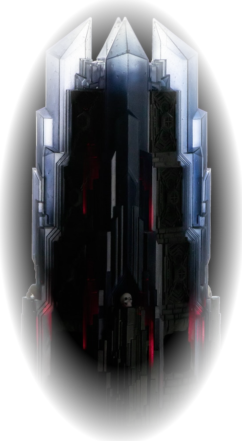

<p align="center">
  
</p>

<h1 align="center">Ultimate Dark Tower</h1>

<p align="center">
  A TypeScript ecosystem for Restoration Games' <em>Return to Dark Tower</em> — libraries,
  renderers, and apps for its real, motorized, Bluetooth-enabled tower.
</p>

<h3 align="center"><a href="https://chessmess.github.io/UltimateDarkTower/">▶ Live Demos</a></h3>

<p align="center">
  <a href="https://github.com/ChessMess/UltimateDarkTower/actions/workflows/ci.yml"></a>
  <a href="LICENSE"></a>
</p>

---

Restoration Games' _Return to Dark Tower_ ships with a motorized, Bluetooth-enabled tower — three
rotating drums, 16 individually addressable LEDs, a 56mm speaker with 113 sound effects, and
infrared skull sensors. This repo is a reverse-engineered TypeScript driver for that hardware,
plus everything built on top of it: renderers, a scenario creator, a relay for sharing tower state
across a network, and companion apps and AI agents that can drive a tower from a chat client.

## Getting Started

```bash
pnpm install    # installs every workspace + builds native BLE deps and @udtc/engine
pnpm run ci     # validate:nodes → lint → format:check → build → typecheck → test
```

Requires **Node ≥ 22.13** and **pnpm ≥ 11** (`packageManager` pins pnpm 11.9.0) — pnpm 11 loads
the built-in `node:sqlite`, so `pnpm install` fails outright on Node 20. Published libraries still
target a Node ≥ 18 _runtime_.

No tower required to start — every app with a UI ships a browser-based 3D emulator, so you can
explore the whole ecosystem without hardware. See [`docs/local-development.md`](docs/local-development.md)
for the full list of per-app dev commands and ports, or jump straight to the
[live demos](https://chessmess.github.io/UltimateDarkTower/).

From here:

- **[Packages](#packages)** — the libraries, for building your own app on top of the tower.
- **[Apps](#apps)** — the runnable companion apps, for playing or driving a tower directly.

## Packages

Reusable libraries under [`packages/`](packages/). Six are published to npm — a seventh,
[`apps/mcp-server`](apps/mcp-server), publishes too, since `npx` is how an MCP server gets
consumed:

| Package                                          | npm                                                                                            | What it is                                                        |
| ------------------------------------------------ | ---------------------------------------------------------------------------------------------- | ----------------------------------------------------------------- |
| [`packages/core`](packages/core)                 | [`ultimatedarktower`](https://www.npmjs.com/package/ultimatedarktower)                         | BLE driver + core library for the physical tower                  |
| [`packages/display`](packages/display)           | [`ultimatedarktowerdisplay`](https://www.npmjs.com/package/ultimatedarktowerdisplay)           | Composable text / 2D / 3D renderers for tower state               |
| [`packages/board`](packages/board)               | [`ultimatedarktowerboard`](https://www.npmjs.com/package/ultimatedarktowerboard)               | 2D game-board renderer, token layout, and Board3D plugin          |
| [`packages/relay-shared`](packages/relay-shared) | [`ultimatedarktowerrelay-shared`](https://www.npmjs.com/package/ultimatedarktowerrelay-shared) | Shared relay protocol types, message factories, constants         |
| [`packages/relay-core`](packages/relay-core)     | [`ultimatedarktowerrelay-core`](https://www.npmjs.com/package/ultimatedarktowerrelay-core)     | Headless relay engine (BLE tower-emulator peripheral + WebSocket) |
| [`packages/relay-client`](packages/relay-client) | [`ultimatedarktowerrelay-client`](https://www.npmjs.com/package/ultimatedarktowerrelay-client) | Framework-agnostic consumer SDK for the relay                     |

Internal (private) Creator libraries: `creator-schema` (`@udtc/schema`), `creator-engine`
(`@udtc/engine`), `creator-adapters` (`@udtc/adapters`), `creator-card-render`
(`@udtc/card-render`), `creator-theme` (`@udtc/theme`).

## Apps

Runnable leaf apps under [`apps/`](apps/). All are private except
[`apps/mcp-server`](apps/mcp-server), which publishes to npm. Publishing is a per-package
`private` flag, not a property of the directory.

| App                                          | Demo / npm                                                                                         | What it is                                                           |
| -------------------------------------------- | -------------------------------------------------------------------------------------------------- | -------------------------------------------------------------------- |
| [`apps/controller`](apps/controller)         | [`/controller/`](https://chessmess.github.io/UltimateDarkTower/controller/)                        | Drive a real tower over BLE, plus a 3D emulator                      |
| [`apps/creator`](apps/creator)               | [`/creator/`](https://chessmess.github.io/UltimateDarkTower/creator/)                              | Scenario creator — deck, dungeon & battle builder                    |
| [`apps/player`](apps/player)                 | [`/player/`](https://chessmess.github.io/UltimateDarkTower/player/)                                | Scenario player (masked-map play engine)                             |
| [`apps/digital`](apps/digital)               | [`/digital/`](https://chessmess.github.io/UltimateDarkTower/digital/)                              | Solo digital play                                                    |
| [`apps/game`](apps/game)                     | [`/game/`](https://chessmess.github.io/UltimateDarkTower/game/)                                    | The Tower's Challenge — an example web game                          |
| [`apps/seed`](apps/seed)                     | [`/seed/`](https://chessmess.github.io/UltimateDarkTower/seed/)                                    | Seed / tower-state decoder                                           |
| [`apps/sync`](apps/sync)                     | [`/sync/`](https://chessmess.github.io/UltimateDarkTower/sync/)                                    | Browser client for the relay                                         |
| [`apps/mcp-server`](apps/mcp-server)         | [`mcp-server-return-to-dark-tower`](https://www.npmjs.com/package/mcp-server-return-to-dark-tower) | MCP server — drive the tower from Claude, ChatGPT, or any MCP client |
| [`apps/relay-cli`](apps/relay-cli)           | —                                                                                                  | Relay daemon (CLI)                                                   |
| [`apps/relay-electron`](apps/relay-electron) | —                                                                                                  | BLE tower-emulator desktop console                                   |

## AI Agents

Two AI coding agents for this ecosystem live in [`.github/agents/`](.github/agents/) and
are documented in [`docs/agents/README.md`](docs/agents/README.md):

| Agent                | Platform                           | Use when...                                                         |
| -------------------- | ---------------------------------- | ------------------------------------------------------------------- |
| Ultimate Dark Tower  | VS Code (Copilot custom agent)     | Writing TypeScript/JS against `packages/core` (`ultimatedarktower`) |
| Return to Dark Tower | Claude.ai / ChatGPT / web AI tools | Controlling the physical tower via `apps/mcp-server`                |

See also the root [`AGENTS.md`](AGENTS.md) for ecosystem context auto-loaded by
AGENTS.md-standard tools (Cursor, Aider, Zed, etc.).

## Development

Day-to-day commands, once you've followed [Getting Started](#getting-started). For the full
breakdown of how the workspace is configured — TypeScript config families, the pnpm catalog,
lint/test setup, CI/CD architecture, and known gotchas — see
[`CONFIGURATION.md`](CONFIGURATION.md).

```bash
pnpm --filter <pkg> build        # build one package/app
pnpm --filter <pkg> test         # test one package/app
pnpm run format                  # prettier --write across the workspace
pnpm run lint                    # eslint across the workspace
```

`ci` builds **before** it typechecks on purpose: cross-package typechecks resolve workspace imports
against each dependency's built `dist/`, so the graph has to exist first.

- **Workspace:** [`pnpm-workspace.yaml`](pnpm-workspace.yaml) — one TypeScript version via `catalog:`,
  `nodeLinker: hoisted`, and `allowBuilds` for the native BLE / esbuild / electron deps.
- **Tooling:** one root [`eslint.config.js`](eslint.config.js) + [`.prettierrc`](.prettierrc), both
  covering the whole workspace. Don't add per-package `eslint` devDeps — a nested copy shadows the
  root flat config and crashes lint. Both `lint` and `format:check` are `ci` gates.
- **Docs:** per-package docs live in each package; Creator/Relay/Sync guides are under
  [`docs/`](docs/).

## Publishing

Published packages use [Changesets](.changeset/) with independent versioning. Add a changeset with
`pnpm changeset` when you change a published package. Pushing to `main` opens a "Version Packages"
PR; merging it bumps versions and publishes from
[`.github/workflows/release.yml`](.github/workflows/release.yml).

What gets published is driven purely by each package's `private` flag —
[`.changeset/config.json`](.changeset/config.json) has an empty `ignore` list, so `private: false`
opts a package in automatically.

> **Adding a newly published package?** Add its name to the `NPM_TOKEN` secret's package
> allow-list on npmjs.com **before** merging its Version Packages PR. The token is a granular
> token scoped to named packages, and it does not learn about new ones — the publish fails, and
> Changesets reports the failure as an unrelated `TypeError` that hides npm's real error.

## License

MIT © ChessMess — see [LICENSE](LICENSE).

Questions or ideas? The community hangs out on the [Ultimate Dark Tower Discord server](https://discord.com/invite/87kffaR3jV).
