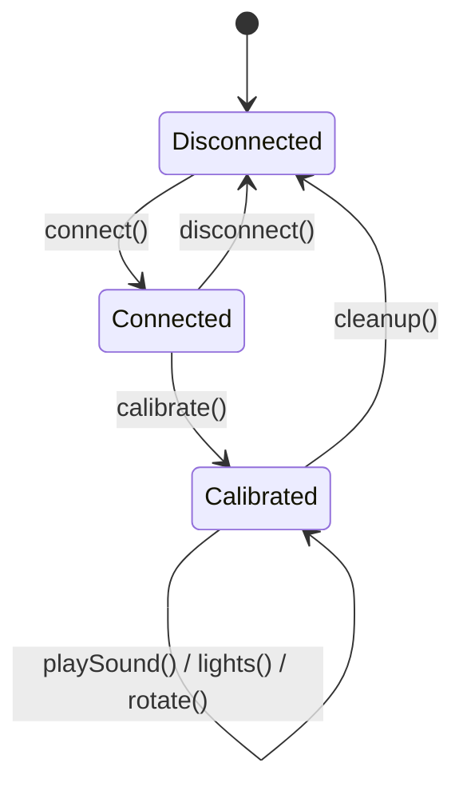

# Getting Started

A 10-minute walkthrough from zero to a tower that calibrates, plays a sound, lights up an LED, and rotates a drum. Assumes you have a Return to Dark Tower device and either a Web Bluetooth–capable browser (Chrome / Edge / Samsung Internet) or Node.js 18+.

> **New here?** This guide covers the happy path. For the full API, see [docs/api/](api/README.md). For a higher-level look at how the pieces fit together, see [docs/ARCHITECTURE.md](ARCHITECTURE.md).

---

## Tower lifecycle at a glance



Every session follows the same shape: **connect → calibrate → use → clean up**. Calibration is required before any drum-rotation or glyph-position operations will be reliable — the tower has no absolute encoder, so until you tell it to find its zero point it doesn't know where its drums are pointing.

---

## 1. Install

### Browser project

```bash
npm install ultimatedarktower
```

### Node.js project

```bash
npm install ultimatedarktower @stoprocent/noble
```

`@stoprocent/noble` is an optional peer dependency that supplies BLE access on Node.js. You only need it if you're running outside a browser.

**Platform requirements:** macOS works out of the box. Linux needs BlueZ (`sudo apt install bluetooth bluez libbluetooth-dev`). Windows needs Windows 10+ with BLE support.

---

## 2. Create a tower instance

The library auto-detects whether you're in a browser or Node.js. In most cases you don't need to configure anything:

```typescript
import UltimateDarkTower from 'ultimatedarktower';

const tower = new UltimateDarkTower();
```

Construction never throws — Bluetooth platform detection is deferred until `connect()`, so this works even where Web Bluetooth is unavailable (e.g. iOS Safari). If your app only uses software-only state (broken seals, rendering) and never connects to a tower, make that explicit with `new UltimateDarkTower({ platform: BluetoothPlatform.NONE })`.

If you need to override auto-detection (Electron in a hybrid mode, custom platforms, or testing), see [docs/api/connection.md](api/connection.md) and [docs/api/adapters.md](api/adapters.md).

---

## 3. Wire up event callbacks (optional but recommended)

The tower talks back to you through a small set of callbacks. Set the ones you care about **before** connecting so you don't miss the first events:

```typescript
tower.onTowerConnect = () => console.log('Tower connected!');
tower.onTowerDisconnect = () => console.log('Tower disconnected!');
tower.onCalibrationComplete = () => console.log('Calibration complete!');
tower.onBatteryLevelNotify = (mv) => console.log(`Battery: ${mv} mV`);
tower.onSkullDrop = (count) => console.log(`Skull dropped! Total: ${count}`);
```

Full callback reference: [docs/api/events.md](api/events.md).

---

## 4. Connect

```typescript
await tower.connect();
```

**In the browser**, this opens the native Web Bluetooth device picker. The user selects "ReturnToDarkTower" and grants permission. There's no way around this — Web Bluetooth requires a user gesture and a chooser, by design.

**In Node.js**, the library scans for the tower automatically. Make sure the tower is powered on and within ~10 meters.

If `connect()` rejects, check the [Troubleshooting guide](TROUBLESHOOTING.md) — the most common causes are the tower being off, out of range, or another app already holding the BLE connection.

---

## 5. Calibrate

```typescript
await tower.calibrate();
```

Calibration spins each drum until it finds its zero point, then returns the drums to known positions. This takes a few seconds and you'll hear the tower making noise. **Don't send other commands during calibration** — they will be queued, but the library temporarily suspends heartbeat monitoring during the calibration sequence, so the connection state can look ambiguous if you're watching from outside.

Once `onCalibrationComplete` fires (or the await resolves), glyph positions are tracked and drum rotations are reliable.

---

## 6. Your first commands

### Play a sound

```typescript
await tower.playSound(1);
```

Sound indices come from the `TOWER_AUDIO_LIBRARY` constant — `1` is the tower's "intro" chime. Browse the full list in [src/udtConstants.ts](../src/udtConstants.ts) or via:

```typescript
import { TOWER_AUDIO_LIBRARY } from 'ultimatedarktower';
console.log(TOWER_AUDIO_LIBRARY);
```

> **Heads-up:** the tower reports "command complete" the moment it starts a sound, not when the sound finishes. If you need to chain sounds, add your own delay or use [`playSoundStateful`](api/commands.md) which preserves other state.

### Light up an LED

```typescript
import { LIGHT_EFFECTS } from 'ultimatedarktower';

// Turn on the top ring's north LED, solid
await tower.setLED(0, 0, LIGHT_EFFECTS.on);
```

The `setLED(layerIndex, lightIndex, effect, loop?)` form is the stateful variant — it preserves every other light, sound, and drum position. `layerIndex` selects one of 6 layers (0–2 = top/middle/bottom ring, 3 = ledge, 4–5 = base1/base2); `lightIndex` selects one of 4 positions per layer. Available effects on `LIGHT_EFFECTS`: `off`, `on`, `breathe`, `breatheFast`, `breathe50percent`, `flicker`. Full layer-to-position map: [docs/TOWER_TECH_NOTES.md](TOWER_TECH_NOTES.md).

### Rotate a drum

```typescript
import { RING_LIGHT_POSITIONS } from 'ultimatedarktower';

// Rotate the middle drum to face north
await tower.rotateDrumStateful(1, RING_LIGHT_POSITIONS.NORTH);
```

`rotateDrumStateful(drumIndex, position, playSound?)` takes a drum index (0 = top, 1 = middle, 2 = bottom) and a numeric position (`NORTH=0`, `EAST=1`, `SOUTH=2`, `WEST=3` on `RING_LIGHT_POSITIONS`). Stateful rotation preserves the other two drums and all lights. If you need to set all three drums at once, use [`Rotate(top, middle, bottom)`](api/commands.md) (note the capital R — it's the multi-drum form and takes string side names like `'north'`).

---

## 7. Clean up

```typescript
await tower.cleanup();
```

Disconnects the BLE session, stops monitoring timers, and releases adapter resources. Always call this when your app shuts down — letting the connection drop without cleanup can leave the tower in an unresponsive state until it times out on its own.

---

## Full example

Putting it all together:

```typescript
import UltimateDarkTower, {
  LIGHT_EFFECTS,
  RING_LIGHT_POSITIONS,
} from 'ultimatedarktower';

async function main() {
  const tower = new UltimateDarkTower();

  tower.onTowerConnect = () => console.log('Connected.');
  tower.onCalibrationComplete = () => console.log('Calibrated.');
  tower.onTowerDisconnect = () => console.log('Disconnected.');

  try {
    await tower.connect();
    await tower.calibrate();
    await tower.playSound(1);
    await tower.setLED(0, 0, LIGHT_EFFECTS.on);
    await tower.rotateDrumStateful(1, RING_LIGHT_POSITIONS.NORTH);
  } catch (err) {
    console.error('Tower error:', err);
  } finally {
    await tower.cleanup();
  }
}

main();
```

Run this in Node.js with `npx tsx getting-started.ts` (or compile to JS first). In the browser, call `main()` from a button-click handler — Web Bluetooth requires a user gesture for `connect()`.

---

## Where to go next

| You want to… | Read |
|---|---|
| See every public method on the tower | [docs/api/README.md](api/README.md) |
| Understand the layers, adapter pattern, and lifecycle | [docs/ARCHITECTURE.md](ARCHITECTURE.md) |
| Run a working demo | [docs/EXAMPLES.md](EXAMPLES.md) |
| Diagnose a disconnect | [docs/TROUBLESHOOTING.md](TROUBLESHOOTING.md) and [docs/BLE_DIAGNOSTICS.md](BLE_DIAGNOSTICS.md) |
| Build a React Native / Cordova adapter | [docs/api/adapters.md](api/adapters.md) |
| Decode a game seed | [docs/api/seed.md](api/seed.md) and [docs/SEED_FORMAT.md](SEED_FORMAT.md) |
