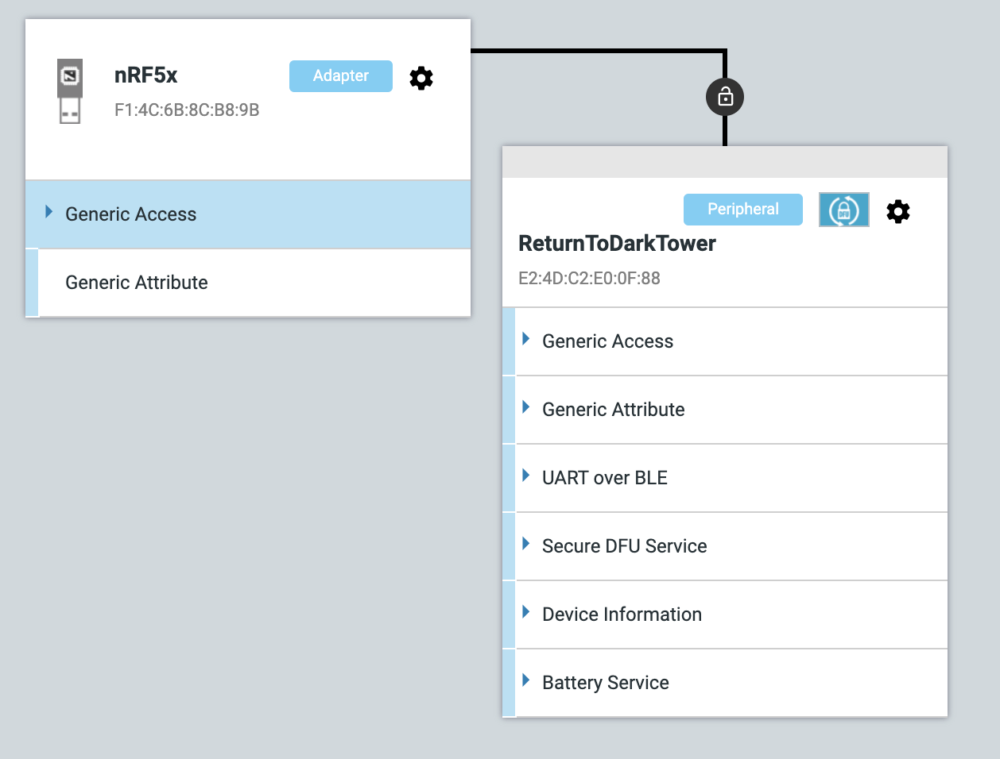
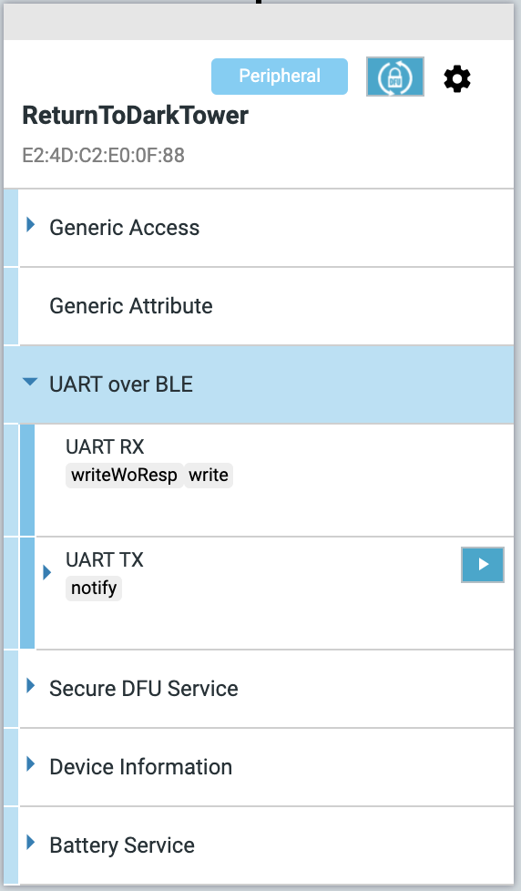
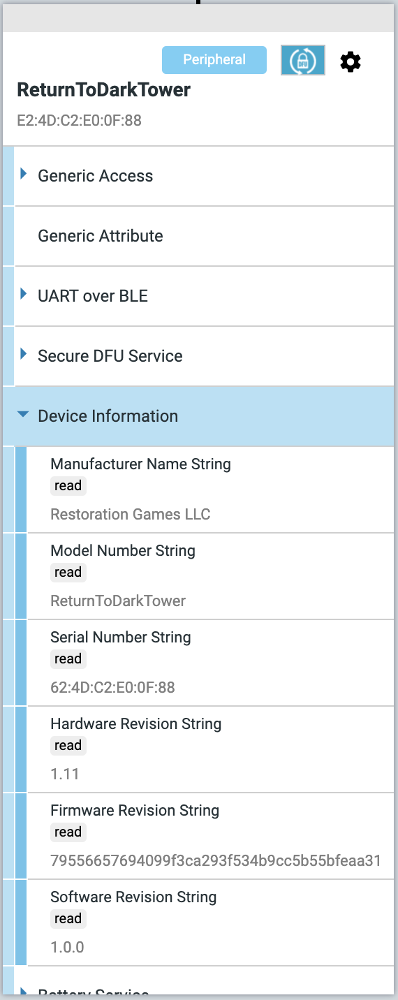
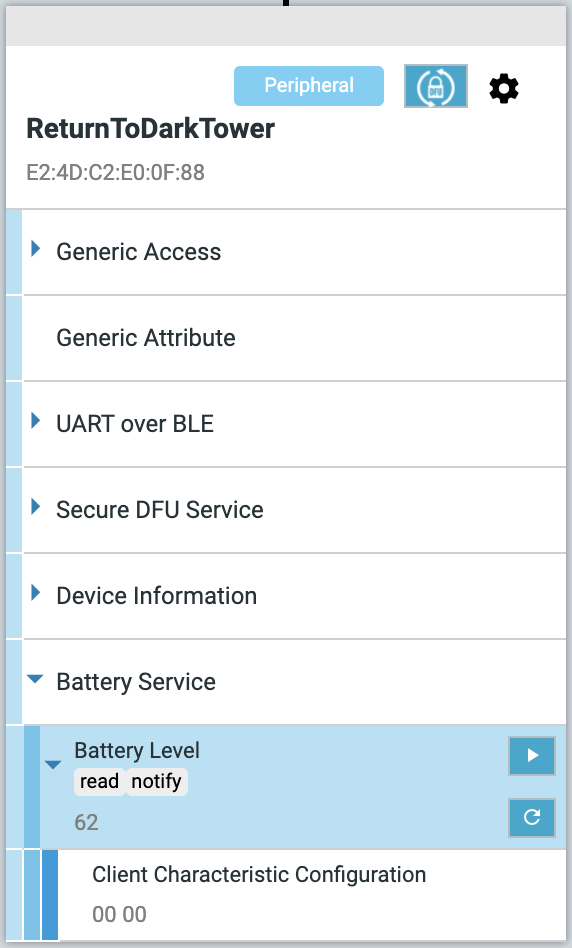
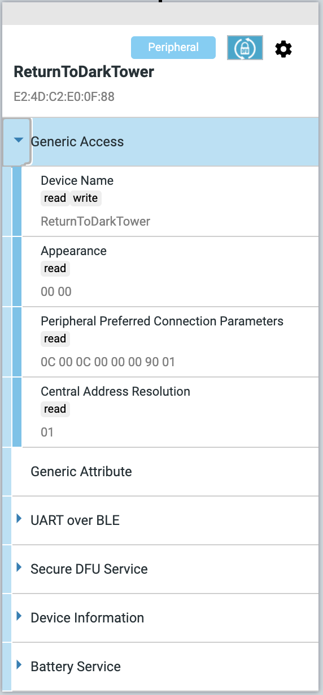
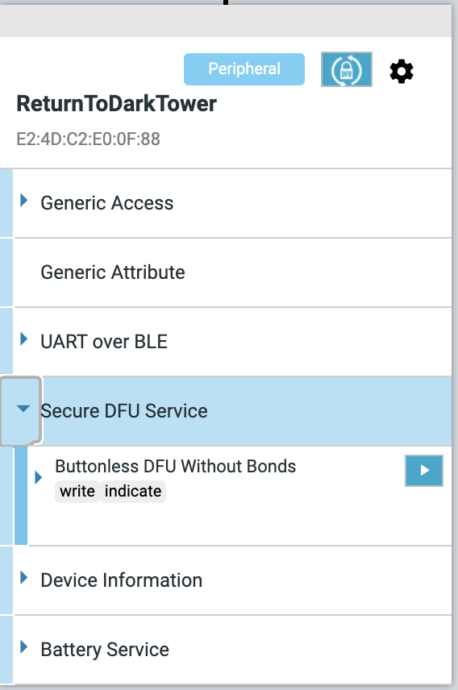
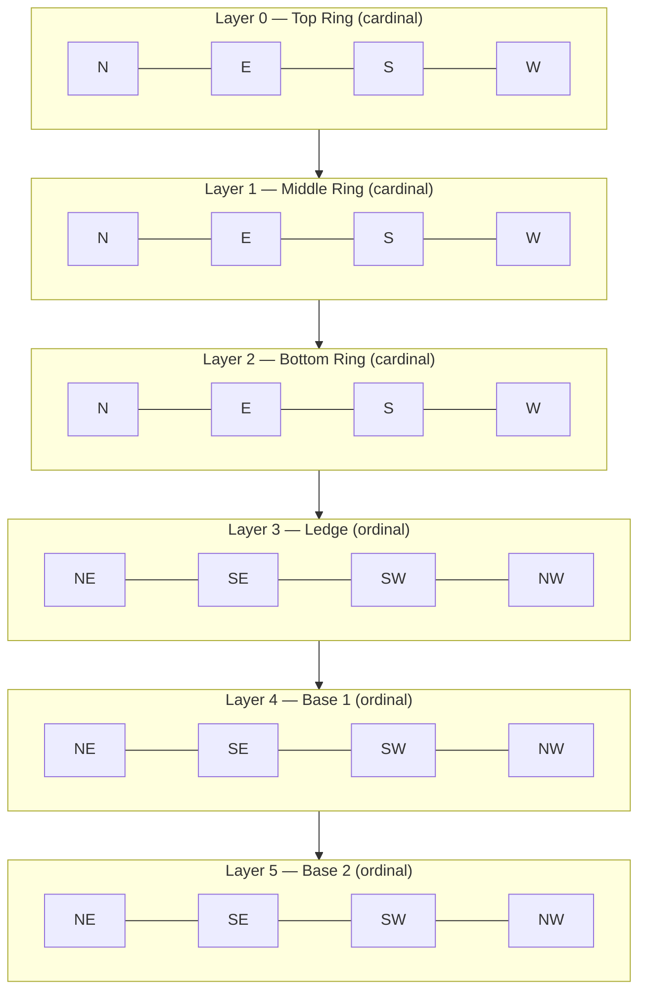

# Tower Technical Reference

Wire-level technical notes for developers reverse-engineering or extending the protocol. Most application developers do **not** need this file — start with [GETTING_STARTED.md](GETTING_STARTED.md) and [api/](api/README.md) instead.

This document covers:

1. The **BLE service tree** the real tower exposes (with screenshots from nRF Connect).
2. The **24-LED hardware layout** — layers, positions, channel mapping.
3. The **20-byte command packet structure** sent over UART.
4. **Response semantics** — transient fields, flow control, animation timing.
5. **Platform-specific quirks** (Noble on macOS).

> Most of these notes were learned the hard way during reverse engineering. If you spot a discrepancy with current hardware or firmware, please open an issue.

---

## BLE Services

The tower advertises as `ReturnToDarkTower` and exposes six GATT services. The library only uses three (UART over BLE, Battery Service, and Device Information Service); the others are listed for completeness.

<p align="center">

</p>

### UART over BLE — the library's primary channel

The Nordic UART Service. All command and response traffic flows through these two characteristics.

| Characteristic | Properties             | Purpose                                                |
| -------------- | ---------------------- | ------------------------------------------------------ |
| **UART RX**    | `writeWoResp`, `write` | Client → tower. 20-byte command packets land here.     |
| **UART TX**    | `notify`               | Tower → client. State notifications come through here. |

UUIDs are exported as `UART_SERVICE_UUID`, `UART_RX_CHARACTERISTIC_UUID`, `UART_TX_CHARACTERISTIC_UUID` from [src/udtConstants.ts](../src/udtConstants.ts).

<p align="center">

</p>

### Device Information

Standard Bluetooth DIS. Read once at connect and surfaced via `getDeviceInformation()` — see [api/connection.md](api/connection.md#getdeviceinformation-deviceinformation).

<p align="center">

</p>

Sample values from a real device: Manufacturer `Restoration Games LLC`, Model `ReturnToDarkTower`, Hardware Revision `1.11`, Software Revision `1.0.0`.

### Battery Service

Standard BLE Battery Service. The tower notifies the percentage value at roughly 5 Hz, which the library uses both for `onBatteryLevelNotify` callbacks and for the heartbeat-based disconnect detector (see [connection.md](api/connection.md#connection-monitoring)).

<p align="center">

</p>

### Generic Access

Standard. Includes the device name (`ReturnToDarkTower`), peripheral preferred connection parameters, etc.

<p align="center">

</p>

### Secure DFU Service (not used by this library)

Nordic's Secure DFU for firmware updates. The library does not interact with this service — firmware updates happen through the official Restoration Games app. Don't do anything with this unless you know exactly what your doing as you can brick your tower.

<p align="center">

</p>

### Generic Attribute

Standard GATT service discovery. Not interacted with directly.

---

## LED Architecture Overview

The Tower uses **24 individually addressable LEDs** organized into 6 logical layers with 4 LEDs each:

- **Layers 0-2**: Ring LEDs (Top, Middle, Bottom rings)
- **Layer 3**: Ledge LEDs
- **Layer 4**: Base1 LEDs
- **Layer 5**: Base2 LEDs



## Layer to Physical Position Mapping

The `TowerState.layer` array maps to physical tower components:

- `layer[0]` = **TOP RING** (positions 0-3 = North, East, South, West)
- `layer[1]` = **MIDDLE RING** (positions 0-3 = North, East, South, West)
- `layer[2]` = **BOTTOM RING** (positions 0-3 = North, East, South, West)
- `layer[3]` = **LEDGE** (positions 0-3 = North-East, South-East, South-West, North-West)
- `layer[4]` = **BASE1** (positions 0-3 = North-East, South-East, South-West, North-West)
- `layer[5]` = **BASE2** (positions 0-3 = North-East, South-East, South-West, North-West)

### Direction Systems

- **Ring layers (0-2)**: Cardinal directions (N, E, S, W)
- **Ledge/Base layers (3-5)**: Ordinal directions (NE, SE, SW, NW)

## LED Channel Lookup Table

The tower converts `(layer * 4) + position` to LED driver channels 0-23:

```
Layer 0: Top Ring    → Channels [0, 3, 2, 1]    (N, E, S, W)
Layer 1: Middle Ring → Channels [7, 6, 5, 4]    (N, E, S, W)
Layer 2: Bottom Ring → Channels [10, 9, 8, 11]  (N, E, S, W)
Layer 3: Ledge       → Channels [12, 13, 14, 15] (NE, SE, SW, NW)
Layer 4: Base1       → Channels [16, 17, 18, 19] (NE, SE, SW, NW)
Layer 5: Base2       → Channels [20, 21, 22, 23] (NE, SE, SW, NW)
```

## Constants Reference

Tower layer and position constants are defined in `src/udtConstants.ts`:

- `TOWER_LAYERS` - Maps layer names to indices (0-5)
- `RING_LIGHT_POSITIONS` - Cardinal direction positions for ring layers
- `LEDGE_BASE_LIGHT_POSITIONS` - Ordinal direction positions for ledge/base layers
- `LED_CHANNEL_LOOKUP` - Hardware LED channel mapping array
- `STATE_DATA_LENGTH` - Binary state data length (19 bytes)

See the source file for the complete definitions and latest values.

## Usage Example

```typescript
import { getTowerPosition, getActiveLights } from './src/udtHelpers';
import { TOWER_LAYERS, RING_LIGHT_POSITIONS, LEDGE_BASE_LIGHT_POSITIONS } from './src/udtConstants';

// Get position for a ring light
const topNorth = getTowerPosition(TOWER_LAYERS.TOP_RING, RING_LIGHT_POSITIONS.NORTH);
// Returns: { level: 'TOP_RING', direction: 'NORTH', ledChannel: 0 }

// Get position for a ledge light
const ledgeNE = getTowerPosition(TOWER_LAYERS.LEDGE, LEDGE_BASE_LIGHT_POSITIONS.NORTH_EAST);
// Returns: { level: 'LEDGE', direction: 'NORTH_EAST', ledChannel: 12 }

// Get all active lights from a tower state
const activeLights = getActiveLights(towerState);
// Returns array with correct level names and LED channel mappings
```

---

# Command Packet Structure Documentation

## Overview

The tower communication uses **20-byte command packets** that consist of:

- **Byte 0**: Command Type (always `0x00` for tower state commands)
- **Bytes 1-19**: Tower State Data (19 bytes containing complete tower state)

## Complete 20-Byte Command Packet Structure

```
 Byte:  00  01  02  03  04  05  06  07  08  09  10  11  12  13  14  15  16  17  18  19
       [CMD][      DRUM STATE     ][            LED STATES (6 layers × 2 bytes)            ][AUD][  BEAM+VOL  ][SEQ]
       [00 ][D0D1][D1D2][L0L0][L0L0][L1L1][L1L1][L2L2][L2L2][L3L3][L3L3][L4L4][L4L4][L5L5][L5L5][AUD][BH ][BL ][VDF][LED]
```

## Byte-by-Byte Breakdown

### Byte 0: Command Type

```
Byte 0: Command Type
Value: 0x00 (always 0 for tower state commands)
```

### Bytes 1-2: Drum States (Top, Middle, Bottom)

Three drums (Top/Middle combined in one byte, Bottom in another) with position, status flags, and sound control.

#### Byte 1: Top Drum + Middle Drum (Partial)

```
Bit:    7       6       5       4       3       2       1       0
      [M_POS1][M_POS0][M_SND][T_CAL][T_JAM][T_POS1][T_POS0][T_SND]

T_SND    = Top drum play sound flag (0=silent, 1=play sound during rotation)
T_POS0-1 = Top drum position (0-3: 0=North, 1=East, 2=South, 3=West)
T_JAM    = Top drum jammed flag (0=not jammed, 1=jammed)
T_CAL    = Top drum calibrated flag (0=not calibrated, 1=calibrated)
M_SND    = Middle drum play sound flag
M_POS0-1 = Middle drum position (0-3: 0=North, 1=East, 2=South, 3=West)
```

#### Byte 2: Middle Drum (Partial) + Bottom Drum

```
Bit:    7       6       5       4       3       2       1       0
      [B_CAL][B_JAM][B_POS2][B_POS1][B_POS0][B_SND][M_CAL][M_JAM]

M_JAM    = Middle drum jammed flag
M_CAL    = Middle drum calibrated flag
B_SND    = Bottom drum play sound flag
B_POS0-2 = Bottom drum position (0-3: 0=North, 1=East, 2=South, 3=West)
B_JAM    = Bottom drum jammed flag
B_CAL    = Bottom drum calibrated flag
```

### Bytes 3-14: LED States (6 Layers × 2 Bytes Each)

Each layer controls 4 LEDs, with each LED using 4 bits (3 for effect, 1 for loop).

#### LED Byte Pattern (applies to all layer bytes)

```
Byte N (LED positions 0&2):     Byte N+1 (LED positions 1&3):
Bit: 7  6  5  4  3  2  1  0     Bit: 7  6  5  4  3  2  1  0
    [POS2_FX ][P2][POS0_FX ][P0]     [POS3_FX ][P3][POS1_FX ][P1]

POS0_FX = Position 0 effect (3 bits: 0-7)
P0      = Position 0 loop flag (1 bit)
POS2_FX = Position 2 effect (3 bits: 0-7)
P2      = Position 2 loop flag (1 bit)
POS1_FX = Position 1 effect (3 bits: 0-7)
P1      = Position 1 loop flag (1 bit)
POS3_FX = Position 3 effect (3 bits: 0-7)
P3      = Position 3 loop flag (1 bit)
```

#### Bytes 3-4: Layer 0 (Top Ring - N,E,S,W)

```
Byte 3: [N_RING_TOP_FX][N_LOOP][S_RING_TOP_FX][S_LOOP]
Byte 4: [W_RING_TOP_FX][W_LOOP][E_RING_TOP_FX][E_LOOP]
```

#### Bytes 5-6: Layer 1 (Middle Ring - N,E,S,W)

```
Byte 5: [N_RING_MID_FX][N_LOOP][S_RING_MID_FX][S_LOOP]
Byte 6: [W_RING_MID_FX][W_LOOP][E_RING_MID_FX][E_LOOP]
```

#### Bytes 7-8: Layer 2 (Bottom Ring - N,E,S,W)

```
Byte 7: [N_RING_BOT_FX][N_LOOP][S_RING_BOT_FX][S_LOOP]
Byte 8: [W_RING_BOT_FX][W_LOOP][E_RING_BOT_FX][E_LOOP]
```

#### Bytes 9-10: Layer 3 (Ledge - NE,SE,SW,NW)

```
Byte 9:  [SW_LEDGE_FX][SW_LOOP][NE_LEDGE_FX][NE_LOOP]
Byte 10: [NW_LEDGE_FX][NW_LOOP][SE_LEDGE_FX][SE_LOOP]
```

#### Bytes 11-12: Layer 4 (Base1 - NE,SE,SW,NW)

```
Byte 11: [SW_BASE1_FX][SW_LOOP][NE_BASE1_FX][NE_LOOP]
Byte 12: [NW_BASE1_FX][NW_LOOP][SE_BASE1_FX][SE_LOOP]
```

#### Bytes 13-14: Layer 5 (Base2 - NE,SE,SW,NW)

```
Byte 13: [SW_BASE2_FX][SW_LOOP][NE_BASE2_FX][NE_LOOP]
Byte 14: [NW_BASE2_FX][NW_LOOP][SE_BASE2_FX][SE_LOOP]
```

### Byte 15: Audio State

```
Bit:    7       6       5       4       3       2       1       0
      [LOOP][        AUDIO_SAMPLE_INDEX (0-127)                ]

AUDIO_SAMPLE_INDEX = Sound sample to play (0-127, 0=no sound)
LOOP               = Audio loop flag (0=play once, 1=loop continuously)
```

### Bytes 16-18: Beam Counter, Volume, Drum Reversal, Fault Flags

#### Bytes 16-17: Beam Break Counter (16-bit)

```
Byte 16: BEAM_COUNT_HIGH (upper 8 bits of 16-bit counter)
Byte 17: BEAM_COUNT_LOW  (lower 8 bits of 16-bit counter)
```

#### Byte 18: Volume, Drum Reversal, Beam Fault

```
Bit:    7       6       5       4       3       2       1       0
      [     VOLUME (0-15)      ][B_REV][M_REV][T_REV][FAULT]

FAULT  = Beam sensor fault flag (0=OK, 1=fault detected)
T_REV  = Top drum reverse flag (0=normal, 1=reverse direction)
M_REV  = Middle drum reverse flag
B_REV  = Bottom drum reverse flag
VOLUME = Audio volume level (0-15, 0=silent, 15=maximum)
```

### Byte 19: LED Sequence Override

```
Byte 19: LED_SEQUENCE (0-255)
Special LED sequence/pattern override (0=normal operation)
```

## LED Effect Values

The 3-bit effect values (0-7) correspond to these lighting patterns:

```
0 = Off
1 = On (solid)
2 = Slow Pulse
3 = Fast Pulse
4 = Slow Fade
5 = Fast Fade
6 = Strobe
7 = Flicker
```

## Example Command Packets

### Example 1: Turn on North Top Ring LED (solid, no loop)

```
Packet: [00,00,00,20,00,00,00,00,00,00,00,00,00,00,00,00,00,00,00,00]

Byte 0:  0x00 = Command type (tower state)
Byte 1:  0x00 = No drum changes
Byte 2:  0x00 = No drum changes
Byte 3:  0x20 = North Top Ring: effect=1 (0x20 = 0010 0000 = effect 1 in bits 7-5)
Bytes 4-19: All zeros (no other changes)
```

### Example 2: Play sound 5 with loop, preserve all other state

```
Packet: [00,00,00,00,00,00,00,00,00,00,00,00,00,00,85,00,00,00,00,00]

Byte 0:  0x00 = Command type
Bytes 1-14: 0x00 = No drum or LED changes
Byte 15: 0x85 = Audio: sample 5 (0x05) + loop flag (0x80) = 0x85
Bytes 16-19: 0x00 = No other changes
```

## Working with Command Packets

### Creating State Commands

1. Get current tower state using `rtdt_unpack_state` from last tower response
2. Modify only the fields you want to change
3. Pack state using `rtdt_pack_state` to get 19 bytes
4. Prepend command type byte (0x00) to create 20-byte command packet
5. Send via `sendTowerCommandDirect`

### Preserving Existing State

The key to avoiding unintended effects (like drum rotation when changing LEDs) is to always start with the current complete tower state and only modify the specific fields you want to change, leaving everything else intact.

## Integration with Tower State Management

This packet structure is used by:

- `rtdt_pack_state()` - Packs TowerState object into bytes 1-19
- `rtdt_unpack_state()` - Unpacks bytes 1-19 into TowerState object
- Command factory methods - Create complete packets by prepending command type
- Response processing - Extracts state from tower responses

The 20th byte (command type) is added by the command layer, while the tower state functions handle the core 19-byte data payload that contains all the actual tower state information.

## Tower Response Behavior

After every BLE write, the tower sends a **state notification** back to the connected app via the TX (notify) characteristic. This response uses the same 20-byte packet format as commands, with byte 0 set to `0x00` (TOWER_STATE). Understanding this response is critical for correct command flow control.

### Transient Fields Are Cleared in Responses

Two fields are **transient** — they appear in the command but are always returned as `0` in the tower's response:

| Byte | Field                 | Command value                                | Response value | Why                                                           |
| ---- | --------------------- | -------------------------------------------- | -------------- | ------------------------------------------------------------- |
| 15   | Audio (sample + loop) | Sound to play (e.g. `0x70` = TowerSeal)      | Always `0`     | Tower plays the sound, then reports "no sound playing"        |
| 19   | LED Sequence Override | Animation to play (e.g. `0x0e` = sealReveal) | Always `0`     | Tower starts the animation, then reports "animation complete" |

All other fields (drums, LED states, beam counter, volume) are **persistent** — they echo back with the values from the command.

The companion app uses these cleared fields as flow control: it waits for a response with `audio = 0` and `ledOverride = 0` before sending the next command. If these fields are not cleared, the app interprets the response as "still animating" and falls back to an **18-second hardcoded timeout**.

**Code reference:** `updateTowerStateFromResponse()` in `UltimateDarkTower.ts` explicitly resets audio: `newState.audio = { sample: 0, loop: false, volume: ... }`.

### Animation Response Timing

The tower does **not** respond immediately. When a command includes an LED Sequence Override (byte 19 ≠ 0), the tower delays its response until the animation finishes. Observed timings:

| LED Override | Name             | Response delay                                   |
| ------------ | ---------------- | ------------------------------------------------ |
| `0x0e`       | sealReveal       | ~1.5–2 seconds                                   |
| `0x0f`       | rotationAllDrums | Duration of drum rotation (8–21 seconds, varies) |
| `0x13`       | monthStarted     | ~16 seconds                                      |

For commands **without** an LED override (byte 19 = 0), the response is near-immediate.

This timing matters because the companion app blocks on the response before sending subsequent commands for certain sequences (notably sealReveal). Responding too early causes the app to send the next command before the animation finishes, visually interrupting it.

> **Note:** For `rotationAllDrums` (0x0f), the companion app uses its own internal timeout (~8–13s) rather than waiting for the tower response, so the tower response delay is less critical for this sequence.

### Response Types

The tower response byte 0 indicates the response type:

| Value | Name                    | Description                                                      |
| ----- | ----------------------- | ---------------------------------------------------------------- |
| `0`   | TOWER_STATE             | Normal state echo (most common — sent after every command)       |
| `1`   | INVALID_STATE           | Error: invalid state data received                               |
| `2`   | HARDWARE_FAILURE        | Error: hardware failure detected                                 |
| `3`   | MECH_JIGGLE_TRIGGERED   | Drum unjam jiggle triggered                                      |
| `4`   | MECH_DURATION           | Diagnostic: rotation duration (ms) after drum rotation completes |
| `5`   | MECH_UNEXPECTED_TRIGGER | Error: unexpected mechanical trigger                             |
| `6`   | DIFFERENTIAL_READINGS   | Diagnostic: voltage readings                                     |
| `7`   | BATTERY_READING         | Battery level in millivolts                                      |
| `8`   | CALIBRATION_FINISHED    | Calibration sequence completed                                   |

The `TOWER_STATE` (0) response is the one relevant for command flow control. The `MECH_DURATION` (4) response is sent _additionally_ after drum rotations and contains the rotation time in milliseconds — it is a diagnostic value, not used for flow control.

### Implications for BLE Emulators and Relays

Any software that acts as a BLE peripheral mimicking the tower (e.g., for command relay) **must**:

1. **Send a state notification after every write.** Without this, the companion app has no flow control and may fire commands in rapid succession (within 1ms).
2. **Clear byte 15 (audio) and byte 19 (LED override) in the response.** Without this, the companion app waits up to 18 seconds before sending the next command.
3. **Delay the response when byte 19 ≠ 0.** Without this, the companion app sends the next command within ~60ms, which can interrupt animations on any downstream tower hardware.

## Noble (Node.js) Platform Notes

### macOS: Service Re-Discovery Invalidates Characteristic References

On macOS, calling `discoverSomeServicesAndCharacteristicsAsync()` multiple times on the same peripheral causes a subtle but critical bug. CoreBluetooth's `didDiscoverServices:` callback returns `peripheral.services` — the **cumulative** list of all previously discovered services, not just the newly requested ones. Noble then recreates `Characteristic` objects for every returned service, replacing entries in its internal `_characteristics` map. Any previously saved characteristic reference (e.g., the UART RX characteristic with a `'data'` event listener) becomes stale — Noble routes incoming notification data to the new object, and the old listener never fires.

**Symptoms:** Zero BLE data received (`rxDataCount = 0`), no errors logged, `subscribeAsync()` completes successfully, writes work fine, GATT reports connected. The tower appears completely unresponsive despite being connected.

**Solution:** Discover all services and characteristics in a single `discoverAllServicesAndCharacteristicsAsync()` call during `connect()`, then reuse the cached characteristic references for subsequent operations like reading Device Information Service (DIS) attributes. Never call service/characteristic discovery a second time after subscribing to notifications.

See the `IMPORTANT` comment in `NodeBluetoothAdapter.connect()` for implementation details.

**Relevant Noble documentation:**

- [Noble README — Characteristic Methods](https://github.com/stoprocent/noble#characteristic-methods) — `subscribeAsync()`, `data` event, `notificationsAsync()` API
- [Noble README — Peripheral Methods](https://github.com/stoprocent/noble#peripheral-methods) — `discoverAllServicesAndCharacteristicsAsync()`, `discoverSomeServicesAndCharacteristicsAsync()`
- [Refactored notifications commit (c0222c6)](https://github.com/stoprocent/noble/commit/c0222c6c17cac4fae7e1bdfd9f7e767e24df90ea) — Changed `'read'` event to `'data'` event, added `notificationsAsync()` async iterator
- [Apple CoreBluetooth — discoverServices:](<https://developer.apple.com/documentation/corebluetooth/cbperipheral/discoverservices(_:)>) — Documents that previously discovered services accumulate on `peripheral.services`
