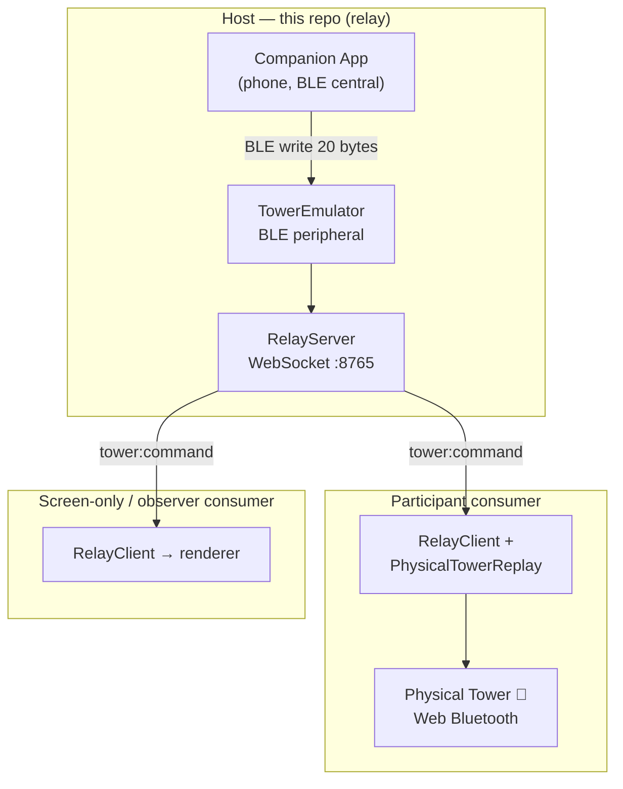

# UltimateDarkTowerRelay

[](LICENSE)
[](https://www.typescriptlang.org/)
[](https://nodejs.org/)

A standalone app that connects to Restoration Games' official *Return to Dark Tower* companion app
**as if it were a real tower**, then relays the tower traffic to any number of digital consumers over
the local network.

> **Status:** Phases 1–4 implemented — relay parity, notification synthesis, the consumer SDK, the
> real-tower path + resilience, the event log, the log-analysis CLI, and the Electron operator GUI.
> LAN-only for v1; internet reach (Tailscale / hosted rooms) is a documented future phase.

---

## Table of Contents

- [What Is This?](#what-is-this)
- [How It Works](#how-it-works)
- [Who Consumes the Relay](#who-consumes-the-relay)
- [Architecture](#architecture)
- [Packages](#packages)
- [Quick Start](#quick-start)
- [Platform Support](#platform-support)
- [Documentation](#documentation)
- [Ecosystem](#ecosystem)
- [License](#license)

---

## What Is This?

The official *Return to Dark Tower* (RTDT) companion app talks to the physical tower over Bluetooth LE,
with the **app as the BLE central** and the **tower as the peripheral**. A browser cannot advertise as a
BLE peripheral (Web Bluetooth is central-only), so any software that wants the official app to "drive" it
must run a Node/Electron process that advertises a tower emulator peripheral.

**UltimateDarkTowerRelay is that process.** It advertises a tower emulator the official app connects to,
decodes every 20-byte command the app writes, fans those commands out to consumers over WebSocket, and
**synthesizes the tower→app return traffic** a real tower would send — including responses driven by
player actions reported back from a consumer (e.g. "I dropped a skull"). It can also connect to a
**real** master tower as a BLE central and relay *its* state outward.

---

## How It Works

```
Official App (phone, BLE central)
  │  BLE write (20-byte command)
  ▼
TowerEmulator (BLE peripheral)  ◄── synthesized tower→app notifications ──┐
  │  decode → TowerState                                              │
  ▼                                                                   │
RelayServer (assigns a monotonic seq, broadcasts over WebSocket)      │
  ├──► consumer: tower-mirror (writes commands to its own tower)      │
  ├──► consumer: screen-only (decodes + renders the state)            │
  └──► consumer: observer (read-only)                                 │
                                                                      │
NotificationSynthesizer (per-write echo, calibration, skull drop) ────┘
```

Because every command is a **complete, idempotent 20-byte state snapshot** (not a delta), relaying is
fire-and-forget safe: a consumer that misses one command is corrected by the next, and a late joiner
catches up instantly from the last command. See [docs/ARCHITECTURE.md](docs/ARCHITECTURE.md).

---

## Who Consumes the Relay

The relay publishes a **framework-agnostic consumer SDK** (`ultimatedarktowerrelay-client`) so any app
can integrate without re-implementing the transport. Consumers fall into two roles:

- **Participant** — has a physical tower or reports player actions. The
  [UltimateDarkTowerSync](../UltimateDarkTowerSync) remote-multiplayer client is the first realized
  consumer: each remote player runs the Sync client, which writes every relayed command to their own
  physical tower so it mirrors the host's "master" tower. **The relay is what the host runs; Sync is
  what the clients run.** Sync is client-only and consumes this repo's published `client` + `shared`
  packages.
- **Observer / screen-only** — any digital or screen-based consumer that renders the decoded tower state
  (LEDs, drum positions, audio, skull drops) without a physical tower. It subscribes to the SDK's decoded
  `state` events and never writes to hardware.

The SDK is built for **N independent consumers**, not a single integration — additional digital consumers
drop in by depending on the published package.

> The client SDK is **publish-ready but not yet on npm**; until the cutover, downstream repos consume it
> via `file:` deps against a sibling checkout.

---

## Architecture



The host intercepts the app's commands and broadcasts them; the participant-reported `client:action`
(e.g. a skull drop) and the synthesized tower→app return traffic are shown in [How It Works](#how-it-works)
above. For the full design — packages, data flow, the hybrid state model, tower sources, and the event
log — see [docs/ARCHITECTURE.md](docs/ARCHITECTURE.md).

---

## Packages

An npm-workspaces monorepo with unscoped package names, matching the UDT family's style.

| Package | Name | What it is |
|---|---|---|
| `packages/shared` | `ultimatedarktowerrelay-shared` | Protocol envelope, `MessageType` + message factories, the `RelayEvent` semantic-event union, `PROTOCOL_VERSION`. |
| `packages/core` | `ultimatedarktowerrelay-core` | Headless engine: `TowerEmulator`, `RelayServer`, `NotificationSynthesizer`, `RealTower`, `EventLog`, logging + log-analysis helpers. |
| `packages/cli` | `ultimatedarktowerrelay-cli` | Headless daemon for servers / Raspberry Pi / Docker; plus `replayEvents` and `analyzeLogs` tools. |
| `packages/electron` | `ultimatedarktowerrelay-electron` | Operator GUI over `core`: status dashboard, runtime source switching, manual controls, log viewer. |
| `packages/client` | `ultimatedarktowerrelay-client` | Published, framework-agnostic **consumer SDK** — `RelayClient` + `PhysicalTowerReplay`. |

---

## Quick Start

### Run the relay (the host)

```bash
npm install
npm run build
npm start                 # BLE tower emulator — the companion app connects; relay listens on ws://0.0.0.0:8765
```

No hardware handy? Use the BLE-free canned source, or the operator GUI:

```bash
npm run start:mock        # BLE-free mock tower source
npm run start:electron    # Electron operator GUI (status, source switching, log viewer)
```

The companion app gates on the Device Information Service before it will exchange commands, and macOS
cannot expose it — so a standalone tower emulator needs a **non-macOS host** (Linux / Raspberry Pi or
Windows). See [docs/SETUP.md](docs/SETUP.md) and
[docs/MACOS_BLE_PERIPHERAL_LIMITATION.md](docs/MACOS_BLE_PERIPHERAL_LIMITATION.md).

### Build a consumer (the SDK)

```bash
npm install ultimatedarktowerrelay-client   # (publish-ready; see note above)
```

```ts
import { RelayClient } from 'ultimatedarktowerrelay-client';

const client = new RelayClient({
  label: 'My Visualizer',
  observer: true, // screen-only consumer
  onEvent: (e) => {
    if (e.type === 'state') render(e.state); // decoded TowerState
  },
});
await client.connect('ws://192.168.1.5:8765');
```

A full integration walkthrough is in [docs/GETTING_STARTED.md](docs/GETTING_STARTED.md); the complete
surface is in [docs/API.md](docs/API.md).

---

## Platform Support

| Platform | Relay host | Consumer (browser SDK) | Notes |
|---|---|---|---|
| macOS | ⚠️ | ✅ | Cannot expose the DIS in peripheral mode → needs a real-tower handoff to clear "checking firmware". Works as a real-tower central. |
| Linux / Raspberry Pi | ✅ | ✅ | BlueZ exposes the DIS — the standalone tower-emulator target. |
| Windows | ⚠️ | ✅ | Exposes the DIS; BLE peripheral mode may need a `@stoprocent/bleno`-compatible USB dongle. |

Consumers run anywhere with a Web Bluetooth–capable browser (Chrome / Edge) or Node 18+.

---

## Documentation

Start at the [documentation index](docs/README.md). Highlights:

- [docs/GETTING_STARTED.md](docs/GETTING_STARTED.md) — build a consumer with the SDK.
- [docs/ARCHITECTURE.md](docs/ARCHITECTURE.md) — packages, data flow, state model, tower sources.
- [docs/API.md](docs/API.md) — the consumer SDK reference.
- [docs/PROTOCOL.md](docs/PROTOCOL.md) — the client↔host WebSocket protocol.
- [docs/TOWER_EMULATOR.md](docs/TOWER_EMULATOR.md) — the BLE return-traffic / echo-timing behavior.
- [docs/SETUP.md](docs/SETUP.md) — per-platform host setup (macOS / Raspberry Pi / Windows).
- [docs/TROUBLESHOOTING.md](docs/TROUBLESHOOTING.md) — operational fixes.
- [CHANGELOG.md](CHANGELOG.md) · [CONTRIBUTING.md](CONTRIBUTING.md)

---

## Ecosystem

Part of the unofficial, fan-made *Ultimate Dark Tower* family — see [docs/ECOSYSTEM.md](docs/ECOSYSTEM.md).
The relay is built on the [`ultimatedarktower`](https://github.com/ChessMess/UltimateDarkTower) core
library (BLE driver + 20-byte protocol) and is the shared bridge the
[UltimateDarkTowerSync](../UltimateDarkTowerSync) multiplayer client consumes.

---

## License

MIT — see [LICENSE](LICENSE). *Return to Dark Tower* and its art, sounds, board, and tower model are
© Restoration Games. UltimateDarkTowerRelay is an unofficial, fan-made project for development and
personal play; it impersonates the official tower's BLE identity solely so the official app will connect
for interoperability.
