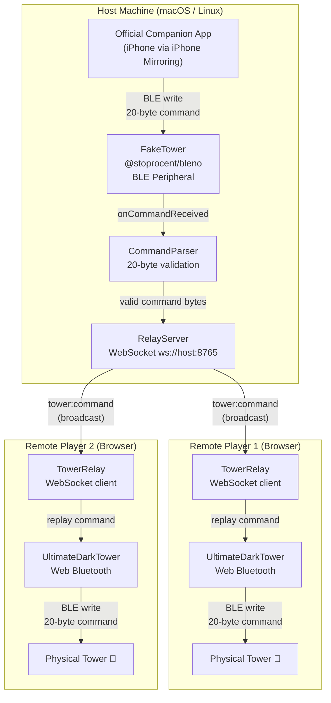

# DarkTowerSync Architecture

This document explains how DarkTowerSync works at a component level.

---

## System Diagram



---

## Component Descriptions

### FakeTower (`packages/host/src/fakeTower.ts`)

FakeTower is a BLE peripheral that impersonates the real Return to Dark Tower hardware.

- **Advertises** the same GATT service UUID and device name as the physical tower.
- **Accepts connections** from the official companion app, which believes it is talking to a real tower.
- **Intercepts writes** to the tower's command characteristic (20-byte packets).
- **Fires a callback** (`onCommandReceived`) with the raw bytes for every intercepted command.

Implementation uses `@stoprocent/bleno` for BLE peripheral mode on Node.js.
Service and characteristic UUIDs come from the [UltimateDarkTower](https://github.com/chessmess/UltimateDarkTower) library constants.

### CommandParser (`packages/host/src/commandParser.ts`)

Validates and annotates raw BLE write payloads before they enter the relay.

- Checks that packets are exactly **20 bytes** long (the fixed tower command length).
- Future iterations can decode the byte structure (drum position, light state, skull/glyph flags, audio) for logging and selective relay.

### RelayServer (`packages/host/src/relayServer.ts`)

WebSocket server that broadcasts intercepted tower commands to all connected remote clients.

- Maintains a set of active client connections via `ConnectionManager`.
- On new client connection: sends a `sync:state` message containing the last known command, so the remote tower can catch up immediately.
- Broadcasts `client:connected` / `client:disconnected` membership events.
- Sends periodic `host:status` updates so clients can display host health.

### ConnectionManager (`packages/host/src/connectionManager.ts`)

Tracks active WebSocket client connections.

- Stores client metadata (ID, label, connect time) and the raw `WebSocket` socket.
- Provides `broadcast()` to send a message to all clients and `sendTo()` for unicast.

---

### TowerRelay (`packages/client/src/towerRelay.ts`)

The browser-side WebSocket client.

- Connects to the host relay server and sends a `client:hello` handshake.
- Receives `sync:state` on connect and replays it on the local tower for immediate catchup.
- Receives `tower:command` messages and replays each one on the local physical tower via Web Bluetooth.

### UltimateDarkTower (Web Bluetooth)

The [UltimateDarkTower](https://github.com/chessmess/UltimateDarkTower) library provides the complete BLE protocol implementation for browser-side tower control.

- Handles the Web Bluetooth device picker, GATT connection, and characteristic writes.
- The client receives raw 20-byte command arrays from the relay and writes them directly to the tower characteristic — no re-encoding needed.

---

## Why Full-State Commands Prevent Sync Drift

Every command the companion app sends to the tower is a **complete state snapshot** — it encodes the full tower state (all drum positions, all 24 LEDs, skull/glyph active flags, audio trigger) in a single 20-byte packet. There are no incremental delta messages.

This means:

- **No accumulation of drift.** A client that misses one command will be corrected by the next one. There is no dependency chain between commands.
- **Late joiners can catch up instantly.** The `sync:state` message carries the last full command, so a newly connected tower reaches the correct visual state immediately.
- **Fire-and-forget is safe.** Because each command is idempotent (replaying it twice produces the same result), the relay does not need acknowledgements or retry logic.

---

## Skull and Glyph Handling

The Return to Dark Tower uses skull and glyph symbols as binary flags within the command packet. Because each command is a full-state snapshot:

- If skulls are active, every subsequent command will include them until the companion app explicitly clears them.
- The relay does not need special skull/glyph logic — it faithfully relays whatever the companion app sends.
- Remote towers will display the same skull/glyph state as the host tower automatically.

---

## Data Flow Summary

```
Companion App
  │  BLE write (20 bytes)
  ▼
FakeTower (bleno)
  │  onCommandReceived(Buffer)
  ▼
CommandParser  ──validates──▶  drop if invalid
  │  valid ParsedCommand
  ▼
RelayServer.broadcast()
  │  JSON: { type: "tower:command", payload: { data: [...] } }
  ├──▶  TowerRelay (Client 1)  ──▶  UltimateDarkTower  ──▶  Tower 1
  ├──▶  TowerRelay (Client 2)  ──▶  UltimateDarkTower  ──▶  Tower 2
  └──▶  TowerRelay (Client N)  ──▶  UltimateDarkTower  ──▶  Tower N
```
