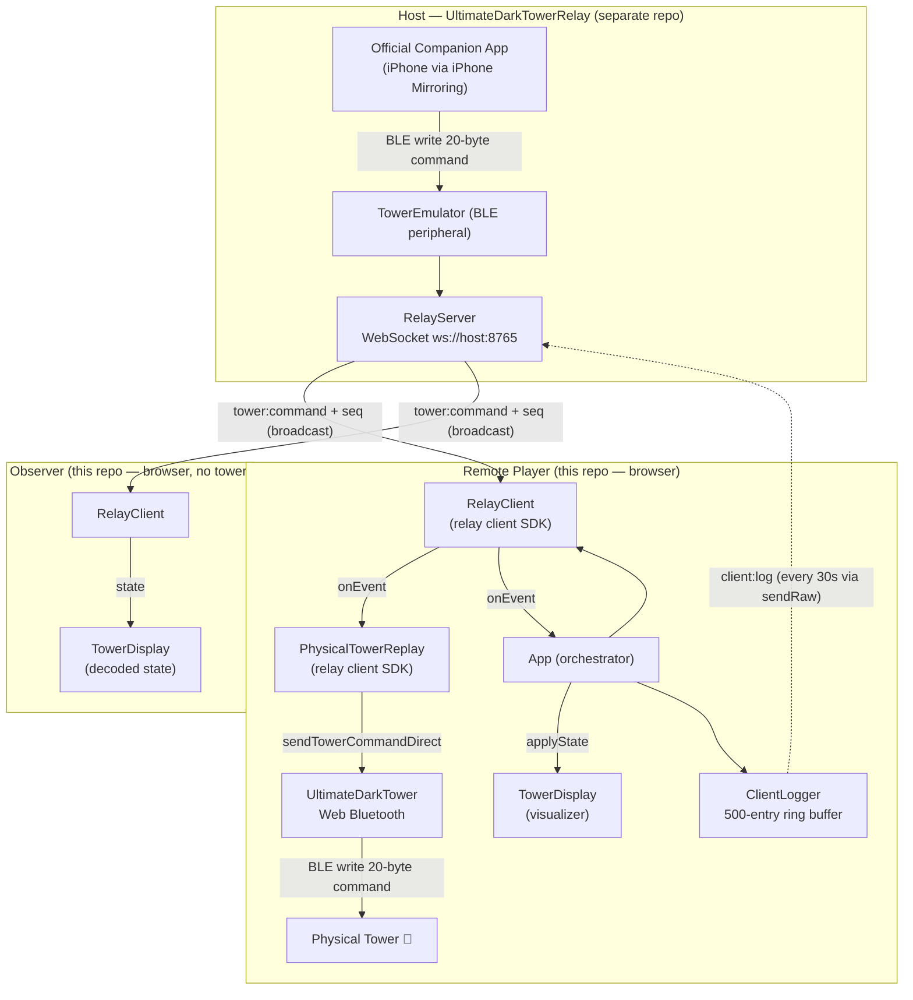

# DarkTowerSync Architecture

This document explains how the DarkTowerSync **browser client** works at a component level.

> **Scope:** DarkTowerSync is **client-only**. The host (BLE tower emulator + WebSocket relay + log server) is
> [UltimateDarkTowerRelay](../UltimateDarkTowerRelay) and is documented there
> ([its ARCHITECTURE](../UltimateDarkTowerRelay/docs/ARCHITECTURE.md),
> [PROTOCOL](../UltimateDarkTowerRelay/docs/PROTOCOL.md),
> [TOWER_EMULATOR](../UltimateDarkTowerRelay/docs/TOWER_EMULATOR.md)). This repo consumes the relay's published
> `client` + `shared` packages.

---

## Table of Contents

- [System Diagram](#system-diagram)
- [Component Descriptions](#component-descriptions)
  - [App](#app-packagesclientsrcappts)
  - [RelayClient (relay SDK)](#relayclient-relay-sdk)
  - [PhysicalTowerReplay (relay SDK)](#physicaltowerreplay-relay-sdk)
  - [UltimateDarkTower (Web Bluetooth)](#ultimatedarktower-web-bluetooth)
  - [TowerDisplay (visualizer)](#towerdisplay-visualizer)
  - [ClientLogger](#clientlogger-packagesclientsrcclientloggerts)
  - [UI](#ui-packagesclientsrcuits)
- [The Host (the relay)](#the-host-the-relay)
- [Why Full-State Commands Prevent Sync Drift](#why-full-state-commands-prevent-sync-drift)
- [Skull and Glyph Handling](#skull-and-glyph-handling)
- [Structured Logging](#structured-logging)
- [Data Flow Summary](#data-flow-summary)

---

## System Diagram



---

## Component Descriptions

The browser client is a small set of classes under `packages/client/src/`. The transport and replay logic
live in the relay's published SDK (`ultimatedarktowerrelay-client`); this repo orchestrates them and renders
the UI.

### App (`packages/client/src/app.ts`)

The client orchestrator. It constructs a `RelayClient` and a `PhysicalTowerReplay`, wires the tower lifecycle,
and routes relay events to the display and logger.

- Constructs `RelayClient({ label, observer, onEvent })` and fans each event out to **both**
  `replay.handleEvent(event)` (to mirror commands on the local tower) and its own `handleRelayEvent(event)`
  (to update the UI / `TowerDisplay` / logs).
- Owns the Web Bluetooth tower lifecycle: on calibration-complete it calls `replay.setTower(tower)`,
  `relay.sendReady(true)`, and `replay.replayLast()`; on disconnect it calls `replay.setTower(null)` and
  `relay.sendReady(false)`.
- Detects observer mode from `?observer` in the URL (observers never connect a tower).

### RelayClient (relay SDK)

`RelayClient` (from `ultimatedarktowerrelay-client`) is the framework-agnostic WebSocket transport.

- Connects to the relay host, performs the `client:hello` handshake (with protocol-version negotiation), and
  auto-reconnects with exponential backoff.
- Delivers messages through a single `onEvent(event: RelayClientEvent)` callback (decoded `state`,
  `tower:command`, `sync:state`, `host:resend`, membership, pause/resume, tower alerts, status…).
- Sends participant signals: `sendReady(ready)`, `dropSkull()` (`client:action`, no-op for observers), and
  `sendRaw(json)` — the transport seam `ClientLogger` uses to ship `client:log` batches.

### PhysicalTowerReplay (relay SDK)

`PhysicalTowerReplay` (from `ultimatedarktowerrelay-client`) is the "remote mirror" consumer: it writes each
relayed 20-byte command to the local physical tower so it mirrors the host's master tower.

- Replays the raw-bearing events (`tower:command`, non-null `sync:state`, `host:resend`); ignores decoded
  `state`.
- Writes are **tower-ready-gated** (`isConnected && isCalibrated`) and **serialized** through a promise queue,
  and `replayLast()` self-heals a tower that reconnects mid-session.
- Receives the local tower via the injected `TowerWriter` (`UltimateDarkTower` satisfies it structurally).
  This fully replaces the old client's hand-rolled `replayOnTower` / `replayQueue` / `lastCommandBytes`.

### UltimateDarkTower (Web Bluetooth)

The [UltimateDarkTower](https://github.com/chessmess/UltimateDarkTower) library provides the browser BLE
implementation — the Web Bluetooth device picker, GATT connection, calibration, and characteristic writes. The
client passes raw 20-byte command arrays straight to `sendTowerCommandDirect()` — no re-encoding.

### TowerDisplay (visualizer)

`TowerDisplay` (from [UltimateDarkTowerDisplay](https://github.com/chessmess/UltimateDarkTowerDisplay)) renders
the tower state. The client calls `towerDisplay.applyState(state)` with the decoded `TowerState` from
`RelayClient`'s `state`/`sync:state`/`host:resend` events. It is used both in **observer mode** (the
visualizer section, no tower) and alongside a tower-bearing player's controls.

### ClientLogger (`packages/client/src/clientLogger.ts`)

A 500-entry ring buffer in the browser. Entries are auto-sent to the host every 30 seconds via `client:log`
(serialized to JSON and sent through `RelayClient.sendRaw`), and can also be sent manually or downloaded as a
local `.jsonl` file. The host controls auto-send via `host:log-config` broadcasts. `ClientLogger` builds the
`client:log` message itself using the protocol types/factories from `ultimatedarktowerrelay-shared`.

### UI (`packages/client/src/ui.ts`)

DOM rendering and user controls (host URL entry, connect, log panel, pause overlay, etc.). `main.ts` is the
entry point that constructs `App`.

---

## The Host (the relay)

The host components — **TowerEmulator** (BLE peripheral), **CommandParser**, **RelayServer**,
**ConnectionManager**, **HostLogger**, and the **log-analysis CLI** — are no longer part of this repo. They
live in [UltimateDarkTowerRelay](../UltimateDarkTowerRelay) and are documented there. The wire protocol
between this client and that host is the relay's [PROTOCOL.md](../UltimateDarkTowerRelay/docs/PROTOCOL.md).

---

## Why Full-State Commands Prevent Sync Drift

Every command the companion app sends to the tower is a **complete state snapshot** — it encodes the full
tower state (all drum positions, all 24 LEDs, skull/glyph active flags, audio trigger) in a single 20-byte
packet. There are no incremental delta messages.

This means:

- **No accumulation of drift.** A client that misses one command will be corrected by the next one. There is
  no dependency chain between commands.
- **Late joiners can catch up instantly.** The `sync:state` message carries the last full command, so a newly
  connected tower reaches the correct visual state immediately.
- **Fire-and-forget is safe.** Because each command is idempotent (replaying it twice produces the same
  result), the relay does not need acknowledgements or retry logic.

---

## Skull and Glyph Handling

The Return to Dark Tower uses skull and glyph symbols as binary flags within the command packet. Because each
command is a full-state snapshot:

- If skulls are active, every subsequent command will include them until the companion app explicitly clears
  them.
- The client does not need special skull/glyph logic — it faithfully replays whatever the host relays.
- Remote towers will display the same skull/glyph state as the host tower automatically.

A participant **reporting** a skull drop (so the host can synthesize the matching tower→app notification) is a
separate path: `RelayClient.dropSkull()` sends a `client:action` to the host (participant-only; no-op for
observers).

---

## Structured Logging

The host assigns a monotonic sequence number (`seq`) to each relayed command, enabling correlation across host
and client log files regardless of clock skew. The **host-side** log writer (`HostLogger`), the combined
session files, and the read-only analysis CLI all live in the relay
([its docs](../UltimateDarkTowerRelay/docs/ARCHITECTURE.md)). The **client-side** half is `ClientLogger` (above),
which reports its ring buffer back to the host as `client:log` batches over `RelayClient.sendRaw`.

---

## Data Flow Summary

```
UltimateDarkTowerRelay host  ──tower:command + seq──▶  (WebSocket broadcast)
  │
  ▼
RelayClient.onEvent(event)
  ├──▶  PhysicalTowerReplay.handleEvent  ──ready-gated, serialized──▶  UltimateDarkTower  ──BLE──▶  Tower
  ├──▶  App.handleRelayEvent  ──applyState──▶  TowerDisplay  ──▶  Browser UI
  └──▶  ClientLogger  ──client:log (every 30s, via RelayClient.sendRaw)──▶  host
```
