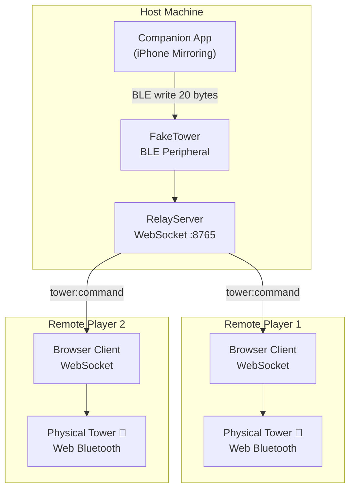

# DarkTowerSync

[](LICENSE)
[](https://www.typescriptlang.org/)
[](https://nodejs.org/)
[](https://www.npmjs.com/package/dark-tower-sync)

Remote multiplayer tower synchronization for **Return to Dark Tower** — relay BLE tower commands over WebSocket so every player's physical tower mirrors the host in real time.

---

## What Is This?

DarkTowerSync lets players in different locations each use their own physical Return to Dark Tower game tower as if they were sitting at the same table. One player runs the **host** — their machine advertises a fake BLE tower to the official companion app, intercepts every 20-byte command the app sends, and relays it over WebSocket to all connected remote clients. Each remote player opens the **browser client**, connects to the host, and the client replays every command on their local physical tower via Web Bluetooth. All towers stay in sync automatically.

Built on top of the [UltimateDarkTower](https://github.com/chessmess/UltimateDarkTower) library for the complete BLE protocol.

---

## Architecture



See [ARCHITECTURE.md](ARCHITECTURE.md) for a full component breakdown.

---

## Quick Start

### Prerequisites

- Node.js 18+ and npm 7+
- A physical Return to Dark Tower game tower (one per player)
- The official Return to Dark Tower companion app (iOS or Android)
- Chrome or Edge browser (for Web Bluetooth support)
- macOS or Linux on the host machine (Windows is a stretch goal)

### Install

```bash
git clone https://github.com/ChessMess/DarkTowerSync.git
cd DarkTowerSync
npm install
```

### Run the Host

```bash
npm run dev:host
# Relay server starts on ws://0.0.0.0:8765
# Open the companion app — it will see the fake tower and connect
```

### Run the Client

```bash
npm run dev:client
# Opens http://localhost:3000
# Enter the host's LAN IP: ws://192.168.x.x:8765
# Click "Connect to Tower" to pair via Web Bluetooth
```

---

## Platform Support

| Platform | Host | Client | Notes                                                    |
| -------- | ---- | ------ | -------------------------------------------------------- |
| macOS    | ✅   | ✅     | Primary platform. iPhone Mirroring for the companion app |
| Linux    | ✅   | ✅     | Requires BlueZ setup — see [SETUP.md](docs/SETUP.md)    |
| Windows  | ⚠️   | ✅     | Host: stretch goal (needs BLE dongle). Client works fine |

### Browser Support (Client)

| Browser           | Supported | Notes                               |
| ----------------- | --------- | ----------------------------------- |
| Chrome 70+        | ✅        | Recommended                         |
| Edge 79+          | ✅        | Chromium-based, works identically   |
| Firefox           | ❌        | No Web Bluetooth API                |
| Safari            | ❌        | No Web Bluetooth API                |
| iOS (Bluefy app)  | ✅        | Third-party browser with BT support |
| Chrome on Android | ✅        | Works on Android 10+                |

---

## Documentation

- [ARCHITECTURE.md](ARCHITECTURE.md) — Component design and data flow
- [docs/SETUP.md](docs/SETUP.md) — Platform-specific setup instructions
- [docs/PROTOCOL.md](docs/PROTOCOL.md) — WebSocket message protocol reference
- [CONTRIBUTING.md](CONTRIBUTING.md) — Development workflow and contribution guide
- [CHANGELOG.md](CHANGELOG.md) — Version history

---

## Related

- [UltimateDarkTower](https://github.com/chessmess/UltimateDarkTower) — The BLE protocol library powering this project

---

## Community

Join the conversation on [Discord](https://discord.com/channels/722465956265197618/1167555008376610945/1167842435766952158).

---

## License

MIT — see [LICENSE](LICENSE).
