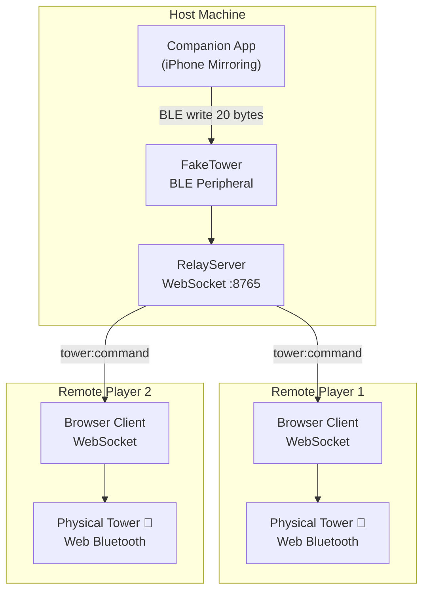

# DarkTowerSync

[](LICENSE)
[](https://www.typescriptlang.org/)
[](https://nodejs.org/)
[](https://www.npmjs.com/package/dark-tower-sync)

Remote multiplayer tower synchronization for **Return to Dark Tower** — relay BLE tower commands over WebSocket so every player's physical tower mirrors the host in real time.

---

## Table of Contents

- [What Is This?](#what-is-this)
- [Architecture](#architecture)
- [Quick Start](#quick-start)
- [Resilience & Reconnection](#resilience--reconnection)
- [Logging & Diagnostics](#logging--diagnostics)
- [Platform Support](#platform-support)
- [Documentation](#documentation)
- [Related](#related)
- [Community](#community)
- [License](#license)

---

## What Is This?

DarkTowerSync lets players in different locations each use their own physical Return to Dark Tower game tower as if they were sitting at the same table. One player runs the **host** — their machine advertises a fake BLE tower to the official companion app, intercepts every 20-byte command the app sends, and relays it over WebSocket to all connected remote clients. Each remote player opens the **browser client**, connects to the host, and the client replays every command on their local physical tower via Web Bluetooth. All towers stay in sync automatically.

Players without a physical tower can join in **observer mode** — add `?observer` to the client URL to see a live visualizer of the tower state (LEDs, drum positions, audio, skull drops) without needing Bluetooth.

Built on top of the [UltimateDarkTower](https://github.com/chessmess/UltimateDarkTower) library for the complete BLE protocol.

---

## Architecture



See [ARCHITECTURE.md](ARCHITECTURE.md) for a full component breakdown.

---

## Quick Start

### Prerequisites

- Node.js 18+ and npm 7+
- A physical Return to Dark Tower game tower (one per player)
- The official Return to Dark Tower companion app (iOS or Android)
- Chrome or Edge browser (for Web Bluetooth support)
- macOS or Linux on the host machine (Windows is a stretch goal)

### Install

```bash
git clone https://github.com/ChessMess/DarkTowerSync.git
cd DarkTowerSync
npm install
```

### Run the Host

```bash
npm run dev:host
# Relay server starts on ws://0.0.0.0:8765
# Open the companion app — it will see the fake tower and connect
```

### Run the Client

Remote players open the hosted client — no install required:

**[https://chessmess.github.io/UltimateDarkTowerSync/](https://chessmess.github.io/UltimateDarkTowerSync/)**

Enter the host's WebSocket address (`ws://192.168.x.x:8765`) and click **Connect to Tower** to pair via Web Bluetooth.

> **Developing locally?** Run `npm run dev:client` to open `http://localhost:3000` instead.

### Observer Mode (no tower needed)

Add `?observer` to the client URL:

**[https://chessmess.github.io/UltimateDarkTowerSync/?observer](https://chessmess.github.io/UltimateDarkTowerSync/?observer)**

The tower Bluetooth card is hidden and a live tower state visualizer appears instead — showing LEDs, drum positions, audio, and skull drops decoded in real time.

---

## Resilience & Reconnection

DarkTowerSync is designed for live game sessions where BLE and network connections are inherently unreliable.

- **Companion app disconnect** — if the companion app loses its BLE connection to the fake tower, all clients instantly see a "Game Paused" overlay. The overlay clears automatically when the app reconnects.
- **WebSocket reconnect** — clients auto-reconnect with exponential backoff (1s → 30s). The UI shows the reconnection attempt count and countdown. On reconnect, the client receives a full state sync.
- **Tower BLE disconnect** — if a player's physical tower drops its Bluetooth connection, the host dashboard highlights the affected player and all peers are notified via `relay:tower:alert`. On reconnect, the last command is replayed automatically after recalibration.
- **Dead client detection** — WebSocket ping/pong (20s interval) detects unresponsive clients within 40 seconds.
- **Zombie handshake cleanup** — clients that connect but never send `client:hello` are removed after 10 seconds.

See [docs/TROUBLESHOOTING.md](docs/TROUBLESHOOTING.md) for an operational runbook covering common mid-game issues.

---

## Logging & Diagnostics

DarkTowerSync includes a structured logging system for diagnosing sync issues across all components.

- **Host** writes JSONL log files to disk (Electron: `userData/logs`, standalone: `./logs`). Each session produces a host-only log and a combined log that includes client entries.
- **Clients** buffer the last 500 log entries in a ring buffer and auto-send them to the host every 30 seconds. Manual "Send Logs" and "Download Logs" buttons are always available.
- **Sequence numbers** — the host assigns a monotonic `seq` to every relayed command, enabling cross-log correlation regardless of clock skew.
- **Master toggle** — the Electron dashboard has a Logging card to pause/resume logging and open the logs folder. Toggling broadcasts to all clients to start/stop auto-send.
- **Analysis tool** — run `npm run analyze -w packages/host` to produce correlation reports, LED override analysis, and anomaly detection from captured JSONL files.

---

## Platform Support

| Platform | Host | Client | Notes                                                    |
| -------- | ---- | ------ | -------------------------------------------------------- |
| macOS    | ✅   | ✅     | Primary platform. iPhone Mirroring for the companion app |
| Linux    | ✅   | ✅     | Requires BlueZ setup — see [SETUP.md](docs/SETUP.md)    |
| Windows  | ⚠️   | ✅     | Host: stretch goal (needs BLE dongle). Client works fine |

### Browser Support (Client)

| Browser           | Supported | Notes                               |
| ----------------- | --------- | ----------------------------------- |
| Chrome 70+        | ✅        | Recommended                         |
| Edge 79+          | ✅        | Chromium-based, works identically   |
| Firefox           | ❌        | No Web Bluetooth API                |
| Safari            | ❌        | No Web Bluetooth API                |
| iOS (Bluefy app)  | ✅        | Third-party browser with BT support |
| Chrome on Android | ✅        | Works on Android 10+                |

---

## Documentation

- [ARCHITECTURE.md](ARCHITECTURE.md) — Component design and data flow
- [docs/SETUP.md](docs/SETUP.md) — Platform-specific setup instructions
- [docs/PROTOCOL.md](docs/PROTOCOL.md) — WebSocket message protocol reference
- [docs/TROUBLESHOOTING.md](docs/TROUBLESHOOTING.md) — Operational runbook for live game sessions
- [CONTRIBUTING.md](CONTRIBUTING.md) — Development workflow and contribution guide
- [CHANGELOG.md](CHANGELOG.md) — Version history

---

## Related

- [UltimateDarkTower](https://github.com/chessmess/UltimateDarkTower) — The BLE protocol library powering this project

---

## Community

Join the conversation on [Discord](https://discord.com/channels/722465956265197618/1167555008376610945/1167842435766952158).

---

## License

MIT — see [LICENSE](LICENSE).
