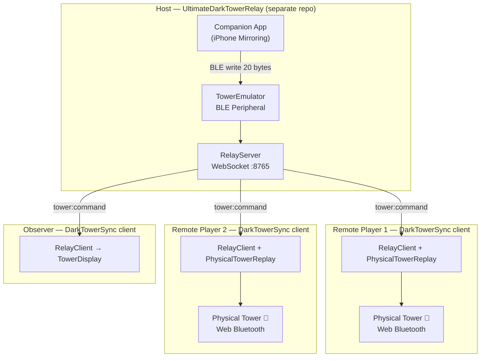

# DarkTowerSync

[](LICENSE)
[](https://www.typescriptlang.org/)
[](https://nodejs.org/)
[](CHANGELOG.md)

Remote multiplayer tower synchronization for **Return to Dark Tower** — the **browser client** that connects to an [UltimateDarkTowerRelay](https://github.com/ChessMess/UltimateDarkTowerRelay) host and mirrors the host's tower on every player's own physical tower in real time.

---

## Table of Contents

- [What Is This?](#what-is-this)
- [Architecture](#architecture)
- [Quick Start](#quick-start)
- [Resilience & Reconnection](#resilience--reconnection)
- [Logging & Diagnostics](#logging--diagnostics)
- [Platform Support](#platform-support)
- [Documentation](#documentation)
- [Related](#related)
- [Community](#community)
- [License](#license)

---

## What Is This?

DarkTowerSync lets players in different locations each use their own physical Return to Dark Tower game tower as if they were sitting at the same table. **This repo is the browser client** that each remote player opens.

The **host** role is run separately by **[UltimateDarkTowerRelay](https://github.com/ChessMess/UltimateDarkTowerRelay)** — the relay advertises a BLE tower emulator to the official companion app, intercepts every 20-byte command the app sends, and relays it over WebSocket. Each remote player opens this **browser client**, connects to the relay host, and the client replays every command on their local physical tower via Web Bluetooth. All towers stay in sync automatically.

> **The relay is what the host runs; DarkTowerSync is what the clients run.** DarkTowerSync used to bundle its own tower-emulator / relay / host / electron code; that now lives in (and is consumed from) the relay. This repo keeps only the browser multiplayer client.

Players without a physical tower can join in **observer mode** — add `?observer` to the client URL to see a live visualizer of the tower state (LEDs, drum positions, audio, skull drops) without needing Bluetooth.

Built on top of the [UltimateDarkTowerRelay](https://github.com/ChessMess/UltimateDarkTowerRelay) client SDK (`RelayClient` + `PhysicalTowerReplay`), the [UltimateDarkTower](https://github.com/chessmess/UltimateDarkTower) library (Web Bluetooth + BLE protocol), and [UltimateDarkTowerDisplay](https://github.com/chessmess/UltimateDarkTowerDisplay) (`TowerDisplay` visualizer).

---

## Architecture



This repo implements only the client subgraphs; the host subgraph is [UltimateDarkTowerRelay](https://github.com/ChessMess/UltimateDarkTowerRelay). See [ARCHITECTURE.md](ARCHITECTURE.md) for the client component breakdown.

---

## Quick Start

### Prerequisites

- Node.js 18+ and npm 7+
- A physical Return to Dark Tower game tower (one per player)
- The official Return to Dark Tower companion app (iOS or Android)
- Chrome or Edge browser (for Web Bluetooth support)
- A **relay host** reachable on the network — run [UltimateDarkTowerRelay](https://github.com/ChessMess/UltimateDarkTowerRelay)

### Run the Host (the relay)

The host role is the relay. See [UltimateDarkTowerRelay](https://github.com/ChessMess/UltimateDarkTowerRelay) — in short, on the host machine:

```bash
# in the UltimateDarkTowerRelay checkout
npm install && npm run build
npm start                 # relay listens on ws://0.0.0.0:8765
# Open the companion app — it sees the tower emulator and connects
```

> Use `TOWER_SOURCE=mock npm start` for a BLE-free desk test, or the relay's Electron operator GUI
> (`npm run start:electron`).

### Install (the client)

```bash
git clone https://github.com/ChessMess/UltimateDarkTowerSync.git
cd UltimateDarkTowerSync
npm install
```

All dependencies — the [relay client SDK](https://github.com/ChessMess/UltimateDarkTowerRelay)
(`ultimatedarktowerrelay-client`/`-shared`), [UltimateDarkTower](https://github.com/chessmess/UltimateDarkTower),
and [UltimateDarkTowerDisplay](https://github.com/chessmess/UltimateDarkTowerDisplay) — are published to npm, so
`npm install` works directly with no sibling checkouts. See [CONTRIBUTING.md](CONTRIBUTING.md) for the optional
local-development workflow (linking those packages from sibling repos).

### Run the Client

Remote players open the hosted client — no install required:

**[https://chessmess.github.io/UltimateDarkTowerSync/](https://chessmess.github.io/UltimateDarkTowerSync/)**

Enter the host's WebSocket address (`ws://192.168.x.x:8765`) and click **Connect to Tower** to pair via Web Bluetooth.

> **Developing locally?** Run `npm run dev:client` to open `http://localhost:3000` instead.

### Observer Mode (no tower needed)

Add `?observer` to the client URL:

**[https://chessmess.github.io/UltimateDarkTowerSync/?observer](https://chessmess.github.io/UltimateDarkTowerSync/?observer)**

The tower Bluetooth card is hidden and a live tower state visualizer appears instead — showing LEDs, drum positions, audio, and skull drops decoded in real time.

---

## Resilience & Reconnection

DarkTowerSync is designed for live game sessions where BLE and network connections are inherently unreliable.

- **Companion app disconnect** — if the companion app loses its BLE connection to the tower emulator, all clients instantly see a "Game Paused" overlay. The overlay clears automatically when the app reconnects.
- **WebSocket reconnect** — clients auto-reconnect with exponential backoff (1s → 30s). The UI shows the reconnection attempt count and countdown. On reconnect, the client receives a full state sync.
- **Tower BLE disconnect** — if a player's physical tower drops its Bluetooth connection, the host dashboard highlights the affected player and all peers are notified via `relay:tower:alert`. On reconnect, the last command is replayed automatically after recalibration.
- **Dead client detection** — WebSocket ping/pong (20s interval) detects unresponsive clients within 40 seconds.
- **Zombie handshake cleanup** — clients that connect but never send `client:hello` are removed after 10 seconds.

See [docs/TROUBLESHOOTING.md](docs/TROUBLESHOOTING.md) for an operational runbook covering common mid-game issues.

---

## Logging & Diagnostics

DarkTowerSync's client participates in a structured logging system that spans the relay host and all clients.

- **The relay host** writes JSONL log files to disk and owns the master logging toggle, the logs folder, and the analysis tooling. See [UltimateDarkTowerRelay](https://github.com/ChessMess/UltimateDarkTowerRelay).
- **This client** (`ClientLogger`) buffers the last 500 log entries in a ring buffer and auto-sends them to the host every 30 seconds via `client:log` (over the relay SDK's `RelayClient.sendRaw`). Manual "Send Logs" and "Download Logs" controls are always available.
- **Sequence numbers** — the host assigns a monotonic `seq` to every relayed command, enabling cross-log correlation between host and client logs regardless of clock skew.
- **Master toggle** — the relay's operator GUI can pause/resume logging; the toggle broadcasts `host:log-config` to all clients to start/stop auto-send.
- **Analysis** — the relay's read-only `npm run analyze:logs` produces correlation reports, LED-override analysis, and anomaly detection from captured JSONL files.

---

## Platform Support

The **Host** column is run by [UltimateDarkTowerRelay](https://github.com/ChessMess/UltimateDarkTowerRelay) (summarized here for reference); this repo is the **Client**.

| Platform | Host (relay) | Client | Notes                                                    |
| -------- | ------------ | ------ | -------------------------------------------------------- |
| macOS    | ✅           | ✅     | iPhone Mirroring for the companion app. Host needs a real-tower handoff for the DIS (see relay docs) |
| Linux    | ✅           | ✅     | Raspberry Pi is the standalone host target (BlueZ exposes the DIS) |
| Windows  | ⚠️           | ✅     | Host: stretch goal (needs BLE dongle). Client works fine |

### Browser Support (Client)

| Browser           | Supported | Notes                               |
| ----------------- | --------- | ----------------------------------- |
| Chrome 70+        | ✅        | Recommended                         |
| Edge 79+          | ✅        | Chromium-based, works identically   |
| Firefox           | ❌        | No Web Bluetooth API                |
| Safari            | ❌        | No Web Bluetooth API                |
| iOS (Bluefy app)  | ✅        | Third-party browser with BT support |
| Chrome on Android | ✅        | Works on Android 10+                |

---

## Documentation

- [ARCHITECTURE.md](ARCHITECTURE.md) — Client component design and data flow
- [docs/SETUP.md](docs/SETUP.md) — Client setup + running the relay host
- [docs/TROUBLESHOOTING.md](docs/TROUBLESHOOTING.md) — Operational runbook for live game sessions
- [CONTRIBUTING.md](CONTRIBUTING.md) — Development workflow and contribution guide
- [CHANGELOG.md](CHANGELOG.md) — Version history
- [UltimateDarkTowerRelay](https://github.com/ChessMess/UltimateDarkTowerRelay) — the host the client connects to; owns the wire protocol ([docs/PROTOCOL.md](https://github.com/ChessMess/UltimateDarkTowerRelay/blob/main/docs/PROTOCOL.md)) and BLE/host docs

---

## Related

- [UltimateDarkTower](https://github.com/chessmess/UltimateDarkTower) — The BLE protocol library powering this project

---

## Community

Join the conversation on [Discord](https://discord.com/channels/722465956265197618/1167555008376610945/1167842435766952158).

---

## License

MIT — see [LICENSE](LICENSE).
