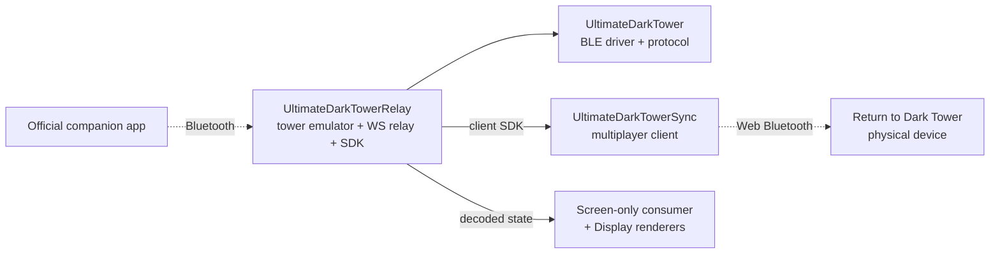

# Ecosystem & Related Projects

*Docs: [Index](README.md) > All > Ecosystem*

UltimateDarkTowerRelay is part of the unofficial, fan-made *Ultimate Dark Tower* family of *Return to Dark
Tower* projects. This page shows where the relay sits and which companion libraries pair with it.

---

## The family

### [UltimateDarkTower](https://github.com/ChessMess/UltimateDarkTower) (core)

The TypeScript/JavaScript BLE driver for the tower: connection, calibration, commands, state tracking, and
the 20-byte protocol, across browsers, Node.js, Electron, and React Native. **The relay is built on it** —
it uses `rtdt_pack_state` / `rtdt_unpack_state`, the UART/command constants, and the high-level
`UltimateDarkTower` class (for the real-tower path).

```bash
npm install ultimatedarktower
```

### UltimateDarkTowerRelay (this repo)

The tower-emulator BLE peripheral + WebSocket relay + consumer SDK. Connects the official companion app as a
tower emulator, relays the traffic, and synthesizes the tower→app return traffic. Publishes
`ultimatedarktowerrelay-client` for consumers.

**When to use:** any time you want the official app to drive software that isn't the physical tower — a
remote-mirror multiplayer host, a screen-only visualizer, or any other digital consumer.

### [UltimateDarkTowerSync](https://github.com/ChessMess/UltimateDarkTowerSync)

The remote-multiplayer **browser client**. Players in different locations each run the Sync client, which
mirrors the host's tower onto their own physical tower in real time. **Sync consumes this repo:** the relay
is what the host runs; Sync is what the clients run. Sync is client-only and depends on the relay's
published `client` + `shared` packages.

**When to use with the relay:** remote co-op play where each player has their own tower.

### [UltimateDarkTowerDisplay](https://github.com/ChessMess/UltimateDarkTowerDisplay)

Composable text, 2D, and 3D renderers for tower state. A screen-only consumer can pair the relay's decoded
`state` events with these renderers to show drum positions, lights, and audio without writing a rendering
layer.

```bash
npm install ultimatedarktowerdisplay
```

### [UltimateDarkTowerBoard](https://github.com/ChessMess/UltimateDarkTowerBoard)

Composable state + renderers for the game **board/mat**. The relay carries *tower* state, not *board*
placement (the official app handles board placement out-of-band), so board state stays a separate concern
a consumer can compose alongside `TowerState`.

---

## How the relay fits



---

## Community

Questions, feedback, or showing off something you built? Join the
[Restoration Games Discord](https://discord.com/channels/722465956265197618/1167555008376610945/1167842435766952158).

---

**See also:** [README index](README.md) · [ARCHITECTURE.md](ARCHITECTURE.md)
