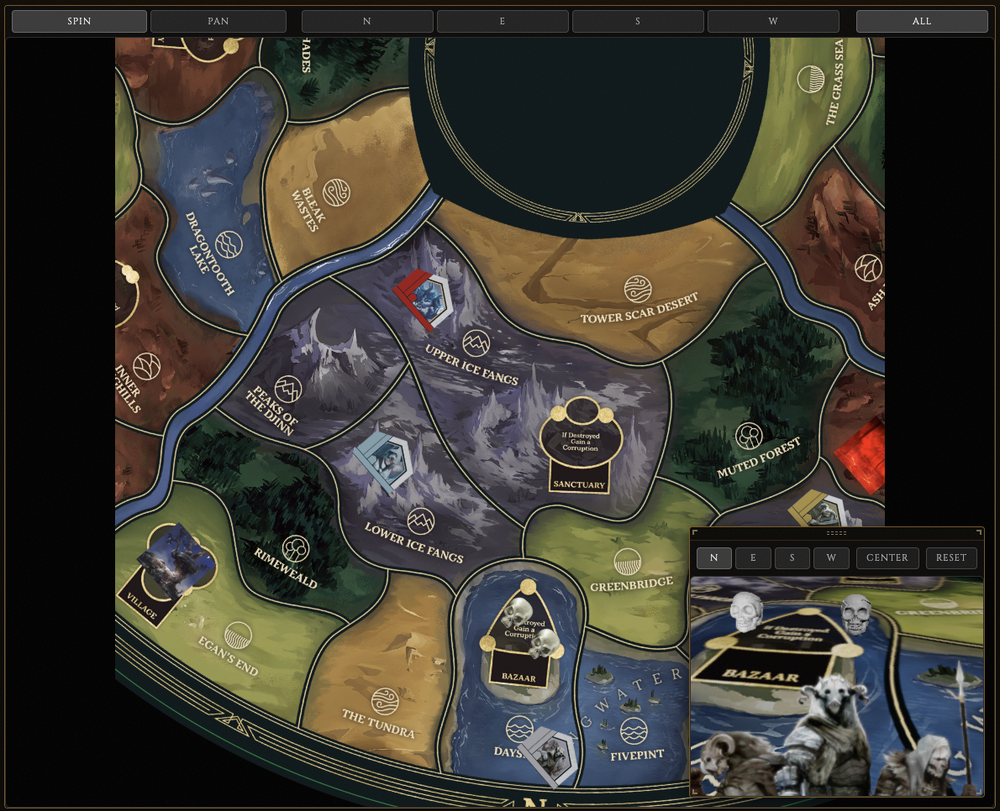

# Ultimate Dark Tower Board

<p align="center">
  
</p>

[](https://github.com/ChessMess/UltimateDarkTower/actions/workflows/ci.yml)
[](https://www.typescriptlang.org/)
[](./LICENSE)

Composable **state + renderers** for the _Return to Dark Tower_ game board. It owns a
`BoardState` (heroes, foes, adversary, skulls-on-buildings, monuments, space markers),
renders it three ways — text readout, 2D overhead map, 3D in-scene board — and ships an
optional dockable editing UI. The 3D board is a `ScenePlugin` for
[`ultimatedarktowerdisplay`](https://github.com/ChessMess/UltimateDarkTower/tree/main/packages/display)'s
`Tower3DView`. It enforces **no game rules**: it stores, renders, and emits events; hosts own rules.

---

<p align="center"><strong>
  <a href="https://chessmess.github.io/UltimateDarkTower/board/">▶ Live Web Demo — Board Example </a>
</strong></p>

---

> **Current Status: pre-release (v0.1.0, not yet published to npm).** Implemented: the headless **state core**
> (structured `BoardState`, the full command reducer, the `BoardStateController` with `self`/`host`
> modes + events, versioned save/load); the **text readout**, **2D overhead map**, and **shared focus
> controls**; the **3D board plugin** (a Display `ScenePlugin`); and the optional **dockable editing
> UI** (palette / inspector / summary). See [`docs/`](./docs/) for the docs set.

## Three entry points

| Import                          | What you get                                                                                                                                          | Heavy deps                                  |
| ------------------------------- | ----------------------------------------------------------------------------------------------------------------------------------------------------- | ------------------------------------------- |
| `ultimatedarktowerboard`        | headless `BoardState` + controller/reducer/commands/events/save-load, the text **readout** and **2D map** renderers, and re-exports of UDT board data | **none** (no `three`, no Display)           |
| `ultimatedarktowerboard/stage`  | `BoardStageView` — the **all-in-one render stage** (2D + 3D, mode switch / PiP / pop-out / Spin-Pan / focus bar / editing UI, tower on-off)           | **none statically** — 3D is **lazy-loaded** |
| `ultimatedarktowerboard/plugin` | `Board3DPlugin` — the 3D board `ScenePlugin`                                                                                                          | `three` + `ultimatedarktowerdisplay`        |

```ts
// Headless / readout / 2D / editing UI — three-free:
import { BoardRenderView, mountBoardUI, BOARD_LOCATIONS } from 'ultimatedarktowerboard';

// The whole interactive stage in one component (the 3D tower is loaded on demand):
import { BoardStageView } from 'ultimatedarktowerboard/stage';

// Just the 3D board, for your own Display scene:
import { Board3DPlugin } from 'ultimatedarktowerboard/plugin';
```

**Fastest path — the stage.** `BoardStageView` does everything the demo does in one component. Its
static graph is `three`-free, so a 2D-only stage never loads `three`; the 3D tower is fetched lazily
the first time it's enabled and can be toggled on/off at runtime. See [docs/STAGE.md](./docs/STAGE.md).

```ts
import { BoardStageView } from 'ultimatedarktowerboard/stage';

const stage = new BoardStageView({
  container: document.getElementById('board')!,
  assetBaseUrl: './tokens/',
  boardImageUrl: './board.png',
  modelUrl: './tower.glb', // omit for a 2D-only stage
});
stage.controller.spawnFoe('foe-1', 'Brigands', 'Dayside');
```

Minimal usage of the lower-level 2D facade — build a view, mutate state through the controller, read the text readout:

```ts
import { BoardRenderView } from 'ultimatedarktowerboard';

const view = new BoardRenderView({ mapContainer: document.getElementById('map')! });
view.controller.placeHero('hero-1', 'Broken Lands');
console.log(view.readout.getText());
```

For the guided walkthrough (install → first render → editing UI) see
[docs/GETTING_STARTED.md](./docs/GETTING_STARTED.md) and [docs/API.md](./docs/API.md) for the full reference.

The optional editing UI (`mountBoardUI`, or `BoardRenderView`'s `uiContainer`) ships three movable,
configurable panels — a token **palette**, a selection **inspector**, and a per-kingdom **summary** — that
call only the controller's public command API. It mounts into any element; pass Display's
`getOverlayContainer()` / `getPanelSlot()` to dock it into the 3D scene. See
[`docs/RENDERERS.md`](./docs/RENDERERS.md).

## Quick start (scaffold)

```bash
npm install
npm run ci          # typecheck + lint + test + build
npm run dev:example # the full demo — 3D board + 2D map + readout + editing UI
```

## Upstream prerequisites

Both upstream dependencies are in place:

- `ultimatedarktower` board data/graph: **shipped in `4.1.0`** and re-exported here —
  `BOARD_LOCATIONS`, `BOARD_ANCHORS`, `BOARD_IMAGE_INFO`, `BOARD_ADJACENCY`, and
  `neighborsOf`/`stepDistance`/`shortestPath`.
- `ultimatedarktowerdisplay`'s `anchorToWorld`: **shipped in `0.9.0`** (peer `^0.9.0`); the 3D plugin's
  token placement uses it.

> **Palette rosters from UDT:** the editing UI's hero / foe / adversary / marker / monument categories all
> source their lists from `ultimatedarktower` re-exports — `HEROES` and `MONUMENTS` were added to UDT for
> this (re-exported, not vendored). No hero art exists, so heroes render via the programmatic fallback.

The `three` peer range is pinned to **Display's exact declared range** (single-instance
requirement). The 3D path inherits Display's heavy transitive footprint (three + the board
image + audio; ~100 MB installed).

## Ecosystem

Part of the _Return to Dark Tower_ family — the **board-domain** sibling to the tower-domain Display:

- [ultimatedarktower](https://github.com/ChessMess/UltimateDarkTower) — BLE driver + the static board
  data this package re-exports (locations, rosters, `BOARD_ANCHORS`, `BOARD_ADJACENCY` + graph helpers).
- [ultimatedarktowerdisplay](https://github.com/ChessMess/UltimateDarkTower/tree/main/packages/display) — the tower's
  text/2D/3D renderers; hosts this package's 3D board as a `ScenePlugin`.

## See also

- [docs/](./docs/) — the full docs set ([getting started](./docs/GETTING_STARTED.md),
  [state model](./docs/STATE_MODEL.md), [renderers](./docs/RENDERERS.md),
  [the all-in-one stage](./docs/STAGE.md),
  [Display integration](./docs/DISPLAY_INTEGRATION.md), [API](./docs/API.md)).
- [CHANGELOG.md](./CHANGELOG.md) — release history.
- [CONTRIBUTING.md](./CONTRIBUTING.md) — development workflow.

## License

MIT © ChessMess
