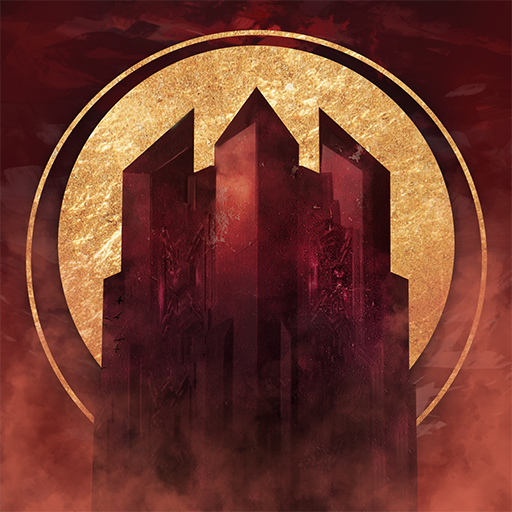
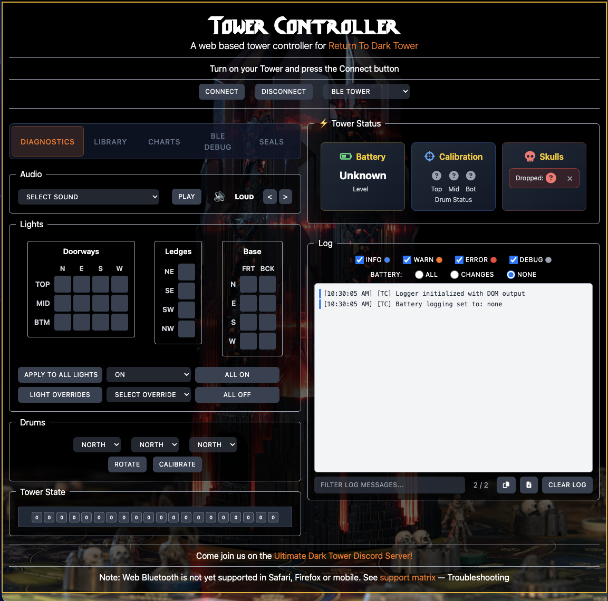

<p align="center">
  
</p>

<h1 align="center">UltimateDarkTower</h1>

<p align="center">
  TypeScript / JavaScript driver for the Bluetooth-enabled tower from Restoration Games' <em>Return to Dark Tower</em>.<br/>
  Control lights, sounds, drum rotation, and track game state from browsers, Node.js, Electron, and React Native.
</p>

<p align="center">
  <a href="https://www.npmjs.com/package/ultimatedarktower"></a>
  <a href="https://www.npmjs.com/package/ultimatedarktower"></a>
  <a href="https://github.com/ChessMess/UltimateDarkTower/actions/workflows/ci-matrix.yml"></a>
  <a href="LICENSE"></a>
  <a href="https://www.typescriptlang.org/"></a>
  <a href="https://nodejs.org/"></a>
</p>

---

<p align="center"><strong>
  <a href="https://chessmess.github.io/UltimateDarkTower/dist/examples/controller/TowerController.html">▶ Live Demo — Tower Controller</a>
</strong></p>

<p align="center"><em>
  Power on your Tower and connect from Chrome / Edge / Samsung Internet or leave it in the box and use the built in Tower Emulator with full 3D rendered Tower! 
  </p><p align="center">
  iOS users: Safari and Chrome doesn't support Web Bluetooth yet on Apples platform (works fine in Chrome on Android), you can use an app on the appstore that provides this feature. </br>Open the demo in the <a href="https://apps.apple.com/us/app/bluefy-web-ble-browser/id1492822055">Bluefy app</a>.
</em></p>

<table>
  <tr>
    <td align="center" width="34%"><a href="examples/controller/README.md"><br/><strong>Controller</strong></a><br/><sub>Full command surface + BLE diagnostics</sub></td>
    <td align="center" width="33%"><a href="examples/game/README.md"><strong>Game</strong></a><br/><sub>A complete playable game on the tower</sub><br/><br/><em>(screenshot soon)</em></td>
    <td align="center" width="33%"><a href="examples/node/README.md"><strong>Node CLI</strong></a><br/><sub>Minimal command-line driver</sub><br/><br/><em>(screenshot soon)</em></td>
  </tr>
</table>

---

## Install

```bash
# Browser
npm install ultimatedarktower

# Node.js (adds the optional BLE peer dependency)
npm install ultimatedarktower @stoprocent/noble
```

> **Platform notes.** Node.js 18+. macOS works out of the box. Linux needs BlueZ (`sudo apt install bluetooth bluez libbluetooth-dev`). Windows needs Windows 10+ with BLE support.

## Quick start

```typescript
import UltimateDarkTower from 'ultimatedarktower';

const tower = new UltimateDarkTower();

tower.onTowerConnect = () => console.log('Connected.');
tower.onCalibrationComplete = () => console.log('Calibrated.');

await tower.connect(); // browser: opens device picker; node: scans
await tower.calibrate(); // required before drum rotation is reliable
await tower.playSound(1);
await tower.cleanup(); // always clean up on shutdown
```

> Walkthrough with explanations, error handling, lights, drum rotation, and a full example: [docs/GETTING_STARTED.md](docs/GETTING_STARTED.md).

## Features

- **Multi-platform Bluetooth** — Web Bluetooth, Node.js (`@stoprocent/noble`), Electron, React Native via custom adapters.
- **Complete tower control** — lights, sounds, drum rotation, seal breaking, skull counter.
- **Stateful command variants** — preserve every other state when changing one field.
- **Glyph tracking** — automatic glyph position updates as drums rotate.
- **Game state** — seal state, broken seals, software-tracked across sessions.
- **BLE flight recorder** — opt-in disconnect diagnostics with structured event capture.
- **Event callbacks** — connect, calibrate, skull drop, battery, state change.
- **Logger** — pluggable outputs (console, DOM, in-memory buffer).
- **TypeScript-first** — full type definitions, ESM + CJS builds.
- **Seed parser** — decode, encode, validate, and compare game seeds.

## Documentation

A guided map of the docs lives at [docs/README.md](docs/README.md). The headline pages:

| Page                                                                         | Use it when…                                        |
| ---------------------------------------------------------------------------- | --------------------------------------------------- |
| [Getting Started](docs/GETTING_STARTED.md)                                   | …you're new and want a working tower in 10 minutes. |
| [API Reference](docs/api/README.md)                                          | …you need the full surface, split by topic.         |
| [Architecture](docs/ARCHITECTURE.md)                                         | …you want to understand how the layers fit.         |
| [Examples](docs/EXAMPLES.md)                                                 | …you want to know what the demo apps demonstrate.   |
| [Tower Tech Notes](docs/TOWER_TECH_NOTES.md)                                 | …you're reverse-engineering the protocol.           |
| [Seed Format](../game-data/docs/SEED_FORMAT.md) (in `ultimatedarktowerdata`) | …you're working with game seeds at the byte level.  |
| [BLE Diagnostics](docs/BLE_DIAGNOSTICS.md)                                   | …you want disconnect flight-recorder data.          |
| [Troubleshooting](docs/TROUBLESHOOTING.md)                                   | …the hardware is misbehaving.                       |
| [Ecosystem](docs/ECOSYSTEM.md)                                               | …you want the companion libraries & tools.          |

## Examples

- **[Controller](examples/controller/README.md)** — full reference UI with a BLE diagnostics tab and tower emulator.
- **[Game](examples/game/README.md)** — The Tower's Challenge, a complete browser game.
- **[Node CLI](examples/node/README.md)** — minimal interactive driver for verifying the Node adapter.

## Platform support

| Platform                                             | Adapter        | Notes                                                                           |
| ---------------------------------------------------- | -------------- | ------------------------------------------------------------------------------- |
| Chrome / Edge / Samsung Internet (desktop + Android) | Built-in       | Web Bluetooth                                                                   |
| Node.js 18+                                          | Built-in       | Requires `@stoprocent/noble`                                                    |
| Electron                                             | Built-in       | Auto-detects renderer vs main process                                           |
| iOS Safari / iOS Chrome                              | —              | Use [Bluefy](https://apps.apple.com/us/app/bluefy-web-ble-browser/id1492822055) |
| Firefox                                              | —              | No Web Bluetooth                                                                |
| React Native                                         | Custom adapter | `react-native-ble-plx` recommended — see [adapters guide](docs/api/adapters.md) |
| Cordova / Capacitor                                  | Custom adapter | See [adapters guide](docs/api/adapters.md)                                      |

## Related projects

This library is part of a wider Return to Dark Tower family. See [docs/ECOSYSTEM.md](docs/ECOSYSTEM.md) for the full list. Highlights:

- **[UltimateDarkTowerDisplay](https://github.com/ChessMess/UltimateDarkTower/tree/main/packages/display)** — composable renderers (text, 2D, 3D) for tower state.
- **[UltimateDarkTowerSync](https://github.com/ChessMess/UltimateDarkTower/tree/main/apps/sync)** — state synchronization across devices.
- **[mcp-server-return-to-dark-tower](https://github.com/ChessMess/mcp-server-return-to-dark-tower)** — MCP server exposing tower control to AI agents.

## Known issues

- **Sound and animation completion** — the tower reports "command complete" the moment a sound or animation _starts_, not when it ends. Don't use the completion response as a "ready for next sound" signal; sleep or use the LED-sequence response timing documented in [docs/TOWER_TECH_NOTES.md](docs/TOWER_TECH_NOTES.md#animation-response-timing).

## Contributing

Workflow, code standards, release process, and hardware testing instructions: [CONTRIBUTING.md](CONTRIBUTING.md).

## Community

Questions? Ideas? Join us on our UltimateDarkTower [Discord Server](https://discord.gg/njgXj6ay3g)!

You can also find us in the RTDT Fan Content Channel on [Restoration Games Discord](https://discord.com/channels/722465956265197618/1167555008376610945/1167842435766952158).

---

## Personal note from the Developer

I have spent many hours reverse engineering the Tower's protocol (by hand, this was before AI existed :D) in order to create this library, I look forward to what others will create using this! - Chris
