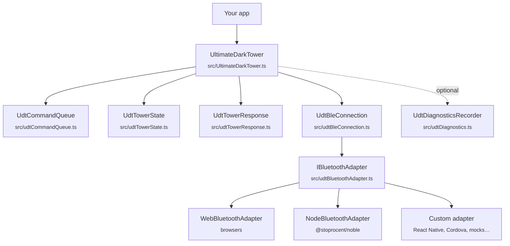
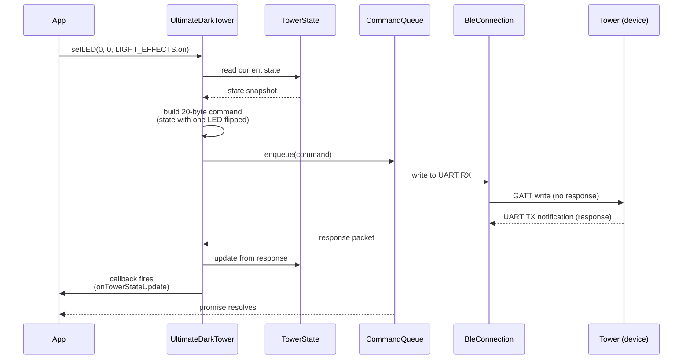
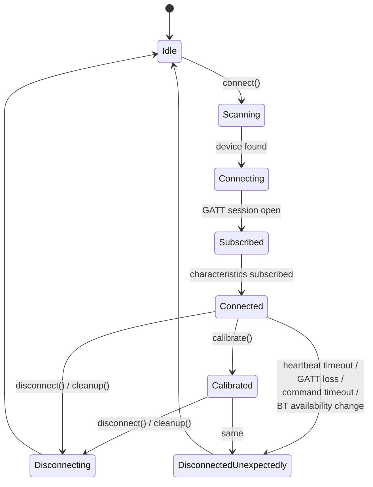

# Architecture

How UltimateDarkTower is organized internally, what each layer is responsible for, and the lifecycle of a tower command from API call to physical effect.

> Looking to **use** the library rather than understand it? Start with [GETTING_STARTED.md](GETTING_STARTED.md) and [api/README.md](api/README.md).

---

## Layer diagram



Each layer has a single responsibility, communicates only with its immediate neighbors, and can be replaced independently. The adapter pattern at the bottom is what lets the same library run in browsers, Node.js, Electron, React Native, and mocks for testing.

---

## What each layer does

### UltimateDarkTower — the public API ([src/UltimateDarkTower.ts](../src/UltimateDarkTower.ts))

The class your app talks to. Holds the assigned event callbacks, exposes high-level commands (`connect`, `calibrate`, `playSound`, `setLED`, `Rotate`, `breakSeal`, …), and coordinates between the queue, state tracker, response parser, and connection layer. This is the only file you need to import in 90% of cases.

### UdtCommandQueue ([src/udtCommandQueue.ts](../src/udtCommandQueue.ts))

Serializes commands so the tower processes them one at a time, with a 30-second response timeout per command. The tower is rate-limited (~200–500 ms minimum between commands) and silently drops packets if you flood it; the queue is what prevents that.

### UdtTowerState ([src/udtTowerState.ts](../src/udtTowerState.ts))

Tracks the current state of every drum, light, audio channel, and beam. Knows how to pack/unpack the 19-byte binary state representation the tower returns. Stateful command variants (`setLED`, `playSoundStateful`, `rotateDrumStateful`, `rotateWithState`) read from and update this state so commands don't clobber each other.

### UdtTowerResponse ([src/udtTowerResponse.ts](../src/udtTowerResponse.ts))

Parses incoming notification packets from the tower — battery readings, command-completion responses, full tower-state dumps, skull drop events. Fires the corresponding event callbacks on `UltimateDarkTower`.

### UdtBleConnection ([src/udtBleConnection.ts](../src/udtBleConnection.ts))

Platform-agnostic connection lifecycle: opens the GATT session via the adapter, subscribes to characteristics, runs the heartbeat monitor, and emits disconnect events. Knows nothing about specific BLE libraries.

### IBluetoothAdapter ([src/udtBluetoothAdapter.ts](../src/udtBluetoothAdapter.ts))

The interface every platform implementation has to satisfy. Methods: `scanForDevice`, `connect`, `disconnect`, `writeCharacteristic`, `subscribeToCharacteristic`, etc., plus the standard error types `BluetoothConnectionError`, `BluetoothDeviceNotFoundError`, `BluetoothUserCancelledError`, `BluetoothTimeoutError`. Ship-supplied implementations live in [src/adapters/](../src/adapters/); custom platforms (React Native, Cordova, mocks) implement this same interface — see [api/adapters.md](api/adapters.md).

### UdtDiagnosticsRecorder ([src/udtDiagnostics.ts](../src/udtDiagnostics.ts)) — optional

Off by default. When enabled, captures a structured ring buffer of recent BLE events plus a full state snapshot at every disconnect. See [BLE_DIAGNOSTICS.md](BLE_DIAGNOSTICS.md) for the rationale and [api/diagnostics.md](api/diagnostics.md) for the API surface.

---

## Lifecycle of a tower command

What happens when you call `await tower.setLED(0, 0, LIGHT_EFFECTS.on)`:



Notice that every stateful command sends a **full tower-state packet**, not a delta. The library reads the current state, mutates the field you asked about, and ships the entire 19-byte payload. That's how it can guarantee no other state gets clobbered.

---

## Connect / disconnect lifecycle



### Disconnect detection — five paths

The library doesn't trust any single signal to declare the connection dead. It watches five:

| Path                         | Trigger                                                          | Latency   |
| ---------------------------- | ---------------------------------------------------------------- | --------- |
| **Battery heartbeat**        | No battery notification for the configured timeout (default 3 s) | ~3 s      |
| **GATT disconnect event**    | Adapter reports the GATT session went down                       | Immediate |
| **Command response timeout** | A queued command's 30 s response timer expired                   | 30 s      |
| **Bluetooth availability**   | Browser reports BT was turned off or removed                     | Immediate |
| **Manual**                   | App called `disconnect()` or `cleanup()`                         | Immediate |

Whichever fires first wins. The diagnostics recorder tags incidents by which path detected the loss, which is the single most useful field when triaging flaky disconnects — see [BLE_DIAGNOSTICS.md](BLE_DIAGNOSTICS.md).

---

## Why the adapter pattern

The Bluetooth surface differs wildly across runtimes:

- **Browser** ([WebBluetoothAdapter](../src/adapters/WebBluetoothAdapter.ts)) — `navigator.bluetooth`. Requires a user-gesture-triggered device chooser. No background scanning.
- **Node.js** ([NodeBluetoothAdapter](../src/adapters/NodeBluetoothAdapter.ts)) — `@stoprocent/noble`. Free-form scanning, no chooser, no user gesture.
- **Electron** — auto-detects renderer (Web Bluetooth) vs main process (Noble).
- **React Native** — typically `react-native-ble-plx`, but the choice is yours.
- **Cordova / Capacitor** — a plugin per platform.
- **Tests** — [MockBluetoothAdapter](../tests/mocks/MockBluetoothAdapter.ts) ships with the test suite.

Pushing all platform variation behind `IBluetoothAdapter` keeps every other layer pure TypeScript with zero environment-specific imports. The same `UltimateDarkTower` class runs in every environment without a build-time flag or a runtime polyfill.

---

## Project layout

```
src/
├── index.ts                  # Public exports
├── UltimateDarkTower.ts      # Main class
├── udtBluetoothAdapter.ts    # IBluetoothAdapter + error types
├── udtBluetoothAdapterFactory.ts  # Platform auto-detection
├── udtBleConnection.ts       # Connection lifecycle, monitoring
├── udtTowerCommands.ts       # Command packet construction
├── udtCommandFactory.ts      # Command-builder helpers
├── udtCommandQueue.ts        # Serialization + timeouts
├── udtTowerResponse.ts       # Response parsing
├── udtTowerState.ts          # State tracking, pack/unpack
├── udtHelpers.ts             # Shared utilities
├── udtLogger.ts              # Logger + outputs
├── udtConstants.ts           # Constants and types
├── udtDiagnostics.ts         # Flight recorder (opt-in)
├── adapters/
│   ├── WebBluetoothAdapter.ts
│   └── NodeBluetoothAdapter.ts
└── sinks/
    └── IndexedDBSink.ts      # Browser-only durable sink
```

> **v6.0.0:** the game/board reference data (`data/`) and the seed encode/decode + RNG
> subsystem (`seed/`) moved to the [`ultimatedarktowerdata`](../../game-data) package — core
> depends on it for the three glyph/light-sequence/audio-library lookups the driver itself
> reads (`GLYPHS`, `TOWER_LIGHT_SEQUENCES`, `TOWER_AUDIO_LIBRARY`). They were never coupled to
> the BLE driver; every other consumer of them had to load a Node-only Bluetooth stack to get
> a list of board locations. See [ultimatedarktowerdata's docs](../../game-data/docs).

---

## See also

- [GETTING_STARTED.md](GETTING_STARTED.md) — happy-path tutorial.
- [api/README.md](api/README.md) — full API reference index.
- [api/adapters.md](api/adapters.md) — building custom adapters.
- [BLE_DIAGNOSTICS.md](BLE_DIAGNOSTICS.md) — how disconnect detection feeds the flight recorder.
- [TOWER_TECH_NOTES.md](TOWER_TECH_NOTES.md) — wire-level protocol, LED channel mapping, BLE service tree.
- [CONTRIBUTING.md](../CONTRIBUTING.md) — workflow for changing any of the above.
