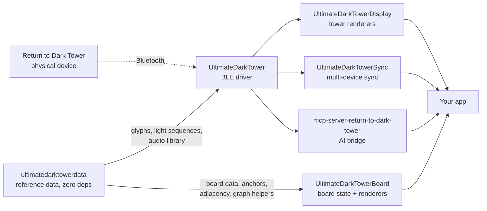

# Ecosystem & Related Projects

UltimateDarkTower is part of a wider family of Return to Dark Tower projects. This page lists the companion libraries, tools, and community resources that pair well with it.

---

## Core

### [UltimateDarkTower](https://github.com/ChessMess/UltimateDarkTower)

**This library.** TypeScript/JavaScript driver for the Bluetooth-enabled tower from Restoration Games' _Return to Dark Tower_. Handles connection, calibration, commands, state tracking, and diagnostics across browsers, Node.js, Electron, and React Native.

```bash
npm install ultimatedarktower
```

### [UltimateDarkTowerDisplay](https://github.com/ChessMess/UltimateDarkTowerDisplay)

Composable text, 2D, and 3D renderers for tower state. Pair it with this library to build a tower-aware companion app — display drum positions, light state, and glyph orientation in your UI without writing the rendering layer yourself.

```bash
npm install ultimatedarktowerdisplay
```

**When to use with UltimateDarkTower:** any time you're building a visual companion (web app, Electron app, dashboard) that needs to mirror the tower's state on screen.

### [UltimateDarkTowerBoard](https://github.com/ChessMess/UltimateDarkTowerBoard)

Composable state + text/2D/3D renderers for the game **board/mat** (heroes, foes, the adversary, skulls-on-buildings, monuments, space markers). It **re-exports** [`ultimatedarktowerdata`](#ultimatedarktowerdata)'s static board data rather than vendoring a copy — `BOARD_LOCATIONS`/`BOARD_GROUPINGS`, the enemy/setup rosters, the foe status + foe/adversary metadata (`FOE_STATUSES`, `FOES`/`ADVERSARY_ROSTER` with level/tier/source), and the board-layout datasets: `BOARD_ANCHORS` + `BOARD_IMAGE_INFO` (token placement) and `BOARD_ADJACENCY` + `neighborsOf`/`stepDistance`/`shortestPath` (the movement graph + helpers a host uses for move validation). As of v6.0.0 this is a dependency on `ultimatedarktowerdata` directly — Board no longer depends on this library at all.

**When to use with UltimateDarkTower:** rendering or editing the board's contents, or composing the board state alongside `TowerState`.

### [ultimatedarktowerdata](../../game-data)

Return to Dark Tower reference data (board locations, foes, heroes, monuments, box inventory, glyphs, seed parsing) with **zero dependencies and no Bluetooth**. Split out of this library in v6.0.0: the driver only ever needed three lookup tables from it (`GLYPHS`, `TOWER_LIGHT_SEQUENCES`, `TOWER_AUDIO_LIBRARY`) and depends on it for those; everything else is consumed directly by Display, Board, and app-level consumers.

```bash
npm install ultimatedarktowerdata
```

**When to use instead of UltimateDarkTower:** you want the reference data (board layout, foe/hero rosters, seed decode) **without** a Bluetooth dependency — a browser app, a content tool, a card generator.

### [UltimateDarkTowerSync](https://github.com/ChessMess/UltimateDarkTowerSync)

DarkTowerSync — state synchronization utility for keeping multiple devices in sync with a single tower instance.

**When to use with UltimateDarkTower:** multi-device setups (phone + tablet, host + spectator screen, livestream overlay).

---

## AI / Tooling

### [mcp-server-return-to-dark-tower](https://github.com/ChessMess/mcp-server-return-to-dark-tower)

Model Context Protocol (MCP) server exposing tower control to AI agents. Lets a Claude/MCP-aware client send commands to the tower through the standardized MCP interface.

```bash
npm install mcp-server-return-to-dark-tower
```

**When to use with UltimateDarkTower:** building AI-driven game experiences or letting an assistant drive the tower as part of a larger workflow.

### [return-to-dark-tower-agents](https://github.com/ChessMess/return-to-dark-tower-agents)

AI coding agents for the RTDT ecosystem — opinionated agent definitions that know about this library and the surrounding tools.

---

## Apps

### [board-game-creator](https://github.com/ChessMess/board-game-creator)

Hero creator for Return to Dark Tower. Live site hosted on GitHub Pages.

---

## Community Resources

### [Return-To-Dark-Tower-Homebrew-Resources](https://github.com/ChessMess/Return-To-Dark-Tower-Homebrew-Resources)

Digital assets and reference material for RTDT homebrews — useful if you're designing custom scenarios, expansions, or print-and-play content.

### [DarkishTower](https://github.com/mighty-bean/DarkishTower) — by mighty-bean

Homage to the **classic** Dark Tower board game (1981) written for the Feather S2 microcontroller and an LCD screen. Not part of the BLE library family, but a great reference if you're interested in the wider Dark Tower lineage. Plays the entire original game; bring your own printed board.

---

## How they fit together



---

## Community

Questions, feedback, or showing off something you built? Join the [Restoration Games Discord](https://discord.com/channels/722465956265197618/1167555008376610945/1167842435766952158).
