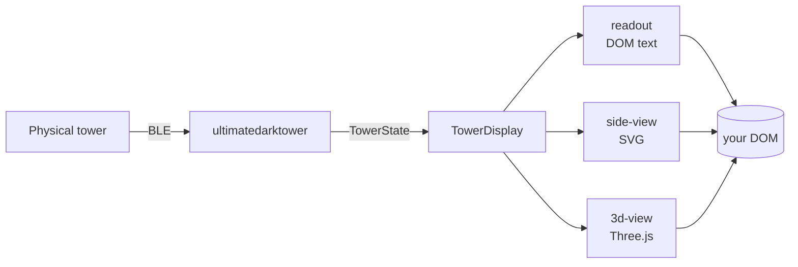

<p align="center">
  
</p>

<h1 align="center">Ultimate Dark Tower Display</h1>

<p align="center">
  Composable text, 2D, and 3D renderers for <a href="https://restorationgames.com/dark-tower/"><em>Return to Dark Tower</em></a> tower state.<br/>
  Pair with <a href="https://github.com/ChessMess/ultimatedarktower"><code>ultimatedarktower</code></a> and ship a tower-aware companion app.
</p>

<p align="center">
  <a href="https://www.npmjs.com/package/ultimatedarktowerdisplay"></a>
  <a href="https://www.npmjs.com/package/ultimatedarktowerdisplay"></a>
  <a href="https://github.com/ChessMess/UltimateDarkTowerDisplay/actions/workflows/ci.yml"></a>
  <a href="LICENSE"></a>
  <a href="https://www.typescriptlang.org/"></a>
</p>

---

<p align="center"><strong>
  <a href="https://chessmess.github.io/UltimateDarkTowerDisplay/">▶ Live Demo — Tower Display</a>
</strong></p>



The physical tower talks BLE to `ultimatedarktower`, which decodes packets into a `TowerState`. This package consumes that state and renders it as any combination of a text readout, a 2D SVG side view, and a 3D Three.js model.

## What this is, what it isn't

This package is the visual layer. It does not open a BLE connection, decode packets, or construct `TowerState` objects. Pair it with [`ultimatedarktower`](https://github.com/ChessMess/ultimatedarktower) (UDT) for the BLE side, or feed it hand-built states for testing and demos.

For the full mental model see [docs/ARCHITECTURE.md](docs/ARCHITECTURE.md).

## Install

```bash
npm install ultimatedarktowerdisplay ultimatedarktower
```

`ultimatedarktower` is a peer dependency. For the 3D renderer also install `three` and `gsap` (peer dependencies). For optional skull physics see [docs/PHYSICS.md](docs/PHYSICS.md).

## Quick start

The recommended entry point is `TowerRenderView` — a single class that wraps a `TowerDisplay` with sensible 3D defaults and optional header chrome (title, subtitle, status badges, action row).

```ts
import { TowerRenderView } from 'ultimatedarktowerdisplay';
import towerModelUrl from 'ultimatedarktowerdisplay/dist/3d/assets/tower.glb?url';
import { createDefaultTowerState } from 'ultimatedarktower';

const container = document.getElementById('tower');
if (!container) throw new Error('Missing #tower container');

const view = new TowerRenderView({ container, modelUrl: towerModelUrl });
view.applyState(createDefaultTowerState());

// Later, when a new state arrives:
// view.applyState(nextState);

// Tear down:
// view.dispose();
```

```html
<div id="tower"></div>
```

`TowerRenderView` accepts every `TowerDisplay` option (renderers, lighting, camera, audio, callbacks). Advanced 3D config that isn't forwarded on the facade is reachable via `view.display.*` and `view.view3D`. The default renderer is `'3d-view'`; pass `renderers: ['readout', 'side-view']` (or any subset) to opt out of the 3D pipeline.

### Composable alternative

If you'd rather wire renderers yourself — or skip the `.trv-root` wrapper entirely — instantiate `TowerDisplay` directly:

```ts
import { TowerDisplay } from 'ultimatedarktowerdisplay';
const display = new TowerDisplay({ container });
display.applyState(createDefaultTowerState());
```

That renders the default composition: a text readout plus a 2D side view.

## Renderers

| Capability               | `readout`            | `side-view`        | `3d-view`                                          |
| ------------------------ | -------------------- | ------------------ | -------------------------------------------------- |
| Rendering tech           | DOM text grid        | Inline SVG         | Three.js + WebGL2                                  |
| Shows LED layers         | All 6, all 4 sides   | One side at a time | On the 3D model                                    |
| Shows drum positions     | Numeric + glyph      | Rotated SVG        | Rotating meshes                                    |
| Shows audio info         | Sample name + volume | No                 | Plays the sample (bundled default pack, swappable) |
| Shows beam + skull count | Yes                  | No                 | No                                                 |
| Side-aware               | No                   | Yes                | Yes                                                |
| Clickable seals          | Optional             | Yes                | No (clicks land in 2D)                             |
| Animations               | None                 | LED tweens         | Full (LEDs, drums, bloom)                          |
| Bundle cost (rough)      | <5 KB gzip           | <10 KB gzip        | ~150 KB gzip + 22 MB GLB + 20 MB audio             |

Both `TowerRenderView` and `TowerDisplay` accept any subset of `['readout', 'side-view', '3d-view']` via the `renderers` option. `TowerRenderView` defaults to `'3d-view'`; `TowerDisplay` defaults to `['readout', 'side-view']`. Full comparison and per-renderer details in [docs/RENDERERS.md](docs/RENDERERS.md).

## Where to go next

- **First integration** → [docs/GETTING_STARTED.md](docs/GETTING_STARTED.md) — prerequisites, `TowerState` shape, framework patterns, UDT wiring.
- **Mental model** → [docs/ARCHITECTURE.md](docs/ARCHITECTURE.md) — data flow, composition, lifecycle, subsystem map.
- **Pick a renderer** → [docs/RENDERERS.md](docs/RENDERERS.md) — feature matrix and per-renderer deep dives.
- **Explore the demo** → [docs/EXAMPLE.md](docs/EXAMPLE.md) — guided tour of every panel in `example/`.
- **Full API reference** → [docs/API.md](docs/API.md) — every public class, method, option, and type.
- **Tune the 3D scene** → [docs/LIGHTING.md](docs/LIGHTING.md) — three-point rig, bloom, skybox, ground disc, tuning recipes.
- **Add skull physics** → [docs/PHYSICS.md](docs/PHYSICS.md) — opt-in subpath with Rapier-driven dynamics.
- **Author LED sequences** → [docs/SEQUENCE_AUTHORING.md](docs/SEQUENCE_AUTHORING.md) — JSON schema, every track kind.
- **Run in Electron** → [docs/ELECTRON.md](docs/ELECTRON.md) — BrowserWindow setup, CSP, BLE picker.
- **Stuck?** → [docs/TROUBLESHOOTING.md](docs/TROUBLESHOOTING.md) — predictable failure modes with fixes.

For the full documentation index see [docs/README.md](docs/README.md).

## Development

```bash
npm install
npm run dev:example   # Vite dev server + open example/index.html
npm run typecheck
npm run lint
npm test
npm run build
npm run ci            # full pipeline (typecheck + lint + test + build)
```

See [CONTRIBUTING.md](CONTRIBUTING.md) for the development workflow and release process.

## License

MIT. See [LICENSE](LICENSE).
