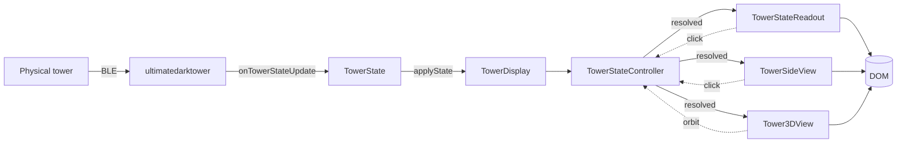
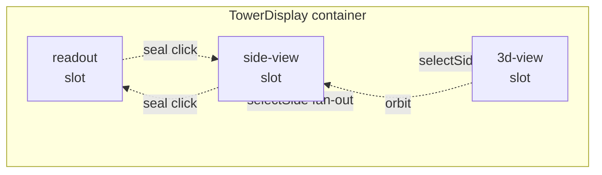
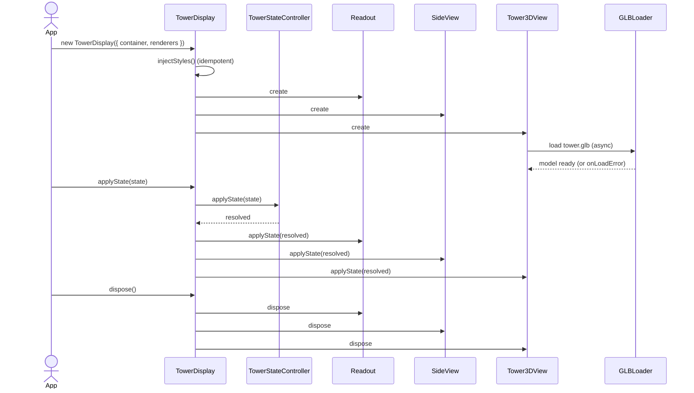

# Architecture

*Docs: [Index](README.md) > Integrator + contributor > Architecture*

**Before reading:** [GETTING_STARTED](GETTING_STARTED.md) covers install and the first `applyState` call.

## Summary

`ultimatedarktowerdisplay` is a pure visual layer. It consumes a `TowerState` produced elsewhere (typically by [`ultimatedarktower`](https://github.com/ChessMess/ultimatedarktower)) and renders it into a DOM container as one or more views: a text readout, a 2D SVG side view, a 3D Three.js model, or any combination. It never opens a BLE connection, never decodes packets, and never mutates the tower.

## Data flow



The physical tower talks BLE to [UDT](https://github.com/ChessMess/ultimatedarktower), which decodes packets into a `TowerState`. Your app passes that state to `TowerDisplay.applyState`. `TowerDisplay` runs the state through `TowerStateController` (which merges in user toggles like clicked seals and LED overrides) and fans the resolved state out to each active renderer. Renderers mutate the DOM. Clicks and camera orbits propagate back through the controller so all renderers stay in sync.

## Composition



`TowerDisplay` is a thin wrapper that creates one container element and mounts up to three slot elements inside it (one per active renderer). The `renderers` option chooses which slots exist; defaults to `['readout', 'side-view']`. Cross-slot fan-out: a seal click in any slot is broadcast to all slots, and a `selectSide` (button click or camera orbit) updates every side-aware renderer.

## The three renderers at a glance

All three implement the same `ITowerDisplay` interface: `applyState`, `applySeals`, `showIdle`, `dispose`. Beyond that they diverge sharply.

| Renderer | Tech | Side-aware | Animated | Bundle cost |
|---|---|---|---|---|
| `TowerStateReadout` | DOM text | No | No | Tiny |
| `TowerSideView` | Inline SVG | Yes | LED tweens only | Small |
| `Tower3DView` | Three.js + WebGL | Yes | Full | Three.js + GSAP + 22 MB GLB |

For the full comparison see [RENDERERS](RENDERERS.md).

## `TowerStateController`

`TowerStateController` is the headless merge layer that sits between an external state source and the renderers. It owns two pieces of user-toggle state — clicked-seal visibility and LED effect overrides — and combines them with the incoming `TowerState` to produce a *resolved* state every renderer agrees on.

It exists as a public export ([API §TowerStateController](API.md#towerstatecontroller)) because some hosts want a non-DOM source of truth — for example a Vuex/Pinia/Zustand store that survives view switches. The example app uses it that way ([EXAMPLE §panel-seals](EXAMPLE.md#panel-seals)).

`TowerDisplay` uses one internally. If you build your own composition you can either let `TowerDisplay` own it (the default) or pass `clickToToggleSeals: false` and drive it yourself.

## Lifecycle



Three things to know:

1. **GLB load is async.** State applied before the model resolves is queued and replayed once it does. Until the model loads, `Tower3DView` renders an empty scene; check `display.loadState` (`'pending' | 'ready' | 'error'`) or wire `onLoadError` to surface failures.
2. **Style injection is idempotent.** First constructor call writes the stylesheet into `document.head`; subsequent calls are no-ops. Pass `injectStyles: false` to opt out and apply the exported `TOWER_DISPLAY_CSS` yourself.
3. **`dispose` is total.** Container content is wiped, animations stop, Three.js resources are freed, and internal toggle state is cleared. A disposed `TowerDisplay` is not reusable — construct a new one.

## Side-awareness and cross-renderer fan-out

`TowerStateReadout` shows all four sides at once (side-blind). `TowerSideView` and `Tower3DView` render one face at a time (side-aware).

When the user clicks a side button on the 2D view, `selectSide` fans out: `TowerSideView` rotates its SVG, `Tower3DView` animates its camera to the matching cardinal facing. The reverse also holds — orbiting the 3D camera past a cardinal heading triggers `onSideChange` and the 2D view rotates to match. Each renderer's `selectSide` early-returns if it already shows the requested side, so the fan-out cannot loop.

`onSealClick` fires exactly once per click regardless of how many renderers are mounted. The seal-toggle state propagates through `TowerStateController` so all renderers stay coherent.

## Subsystem map

| Folder | Role | Key files |
|---|---|---|
| [src/](../src/) | Public entry points + state controller | `index.ts`, `TowerDisplay.ts`, `TowerStateReadout.ts`, `TowerStateController.ts`, `styles.ts`, `types.ts` |
| [src/2d/](../src/2d/) | SVG side view | `TowerSideView.ts`, `TowerSide.svg`, `Seal.svg` |
| [src/3d/](../src/3d/) | Three.js 3D view and managers | `Tower3DView.ts`, `SceneLighting.ts`, `LedEffectAnimator.ts`, `SealManager.ts`, `DrumManager.ts`, `CameraController.ts`, `GroundDiscManager.ts`, `SkyboxManager.ts`, `LightingResolver.ts`, `GameBoardImageTexture.ts`, `EntranceAnimator.ts` |
| [src/audio/](../src/audio/) | Web Audio playback + bundled official sound pack | `TowerSampleAudio.ts`, `DrumRotationAudio.ts`, `audioLibrary.ts`, `sequenceAudio.ts`, `soundPack.ts`, `assets/*.ogg` |
| [src/sequences/](../src/sequences/) | LED sequence player | `SequencePlayer.ts`, `SequenceAnimator.ts`, JSON sequence data |
| [src/state/](../src/state/) | Headless state merge | `TowerStateController.ts` |
| [src/physics/](../src/physics/) | Optional Rapier skull physics | `index.ts`, `PhysicsManager.ts`, `PhysicsResolver.ts`, `buildColliders.ts`, `SkullModelLoader.ts`, `SkullSpawner.ts` |
| [src/shared/](../src/shared/) | Cross-renderer utilities | `SideButtons.ts` |

## Where physics plugs in

The physics subpath is a separate package entry, never loaded unless imported. It attaches to a running `Tower3DView` via `getPhysicsHooks()`, a public seam that exposes the scene, per-drum nodes, a per-frame callback, a seals-applied callback, and the model's vertical and radial bounds.

```ts
const view = new Tower3DView(container);
const physics = attachSkullPhysics(view, { skull: { radiusFactor: 0.03 } });
physics.dropSkull();
```

`attachSkullPhysics` is the only function the host app needs. Internally it builds kinematic colliders that mirror drum positions every frame, dynamic colliders for skulls, and a static floor at the model's bottom. Seal state updates drive collider toggling. See [PHYSICS](PHYSICS.md) for the full model and tuning guide, and [API §TowerPhysicsHooks](API.md#towerphysicshooks) for the seam's shape.

## Extension points

- **`modelUrl`** — override the bundled GLB. Custom models must keep the drum and seal naming contract (`drum_top`, `seal_north_top`, etc.) or those subsystems become no-ops.
- **`skull.modelUrl` / `skull.meshFactory`** — drop arbitrary models (or fully custom `Object3D`s) instead of the default sphere. The library loads `.glb` itself (with a `.stl` fallback); consumers wanting full control return their own `Object3D` from `meshFactory`. See [PHYSICS §Skull Appearance](PHYSICS.md#skull-appearance).
- **`TowerPhysicsHooks.onStateApplied`** — a subscription that fires on every `applyState`. Any add-on (not just skull physics) can use it to react to game-state deltas without owning the state controller.
- **`dracoDecoderPath`** — host the Draco decoder yourself if you cannot reach gstatic.
- **`injectStyles: false`** — apply CSS yourself for CSP-constrained environments. Pair with the exported `TOWER_DISPLAY_CSS` constant.
- **`TowerStateController` as a public export** — drive renderers from a non-DOM store, run them headless in tests, or compose your own multi-renderer layout outside `TowerDisplay`.
- **`TowerPhysicsHooks`** — the seam external add-ons use. Anyone can write a non-skull add-on (smoke, particles, falling glyphs) against the same API.
- **`setLedOverride(layer, light, effect)`** — bypass the underlying state for a single light. Used by the example app's "Trigger Sequence" button.
- **Custom sound packs** — the bundled `DEFAULT_TOWER_SOUND_PACK` plays out of the box. Swap in your own pack at runtime via `applyAudioConfig({ pack })` to use alternative samples; sample IDs come from UDT's `TOWER_AUDIO_LIBRARY`. See [AUDIO](AUDIO.md).

## See also

- [RENDERERS](RENDERERS.md) — per-renderer feature matrix.
- [API](API.md) — full method/option/type reference.
- [PHYSICS](PHYSICS.md) — skull physics integration.
- [LIGHTING](LIGHTING.md) — 3D lighting subsystem.
- [EXAMPLE](EXAMPLE.md) — the demo as a reference integration.
