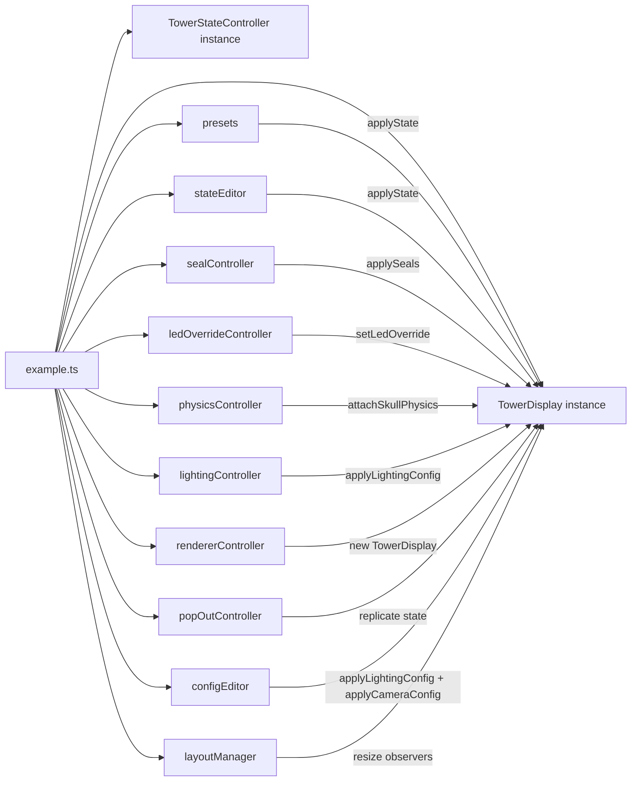

# Example walkthrough

*Docs: [Index](README.md) > Hobbyist + integrator > Example*

**Before reading:** [GETTING_STARTED](GETTING_STARTED.md) covers install and a minimal `TowerDisplay`.

The `example/` folder is an interactive playground that exercises every public capability of the library. This doc tours it panel by panel, so you can lift the patterns you need without reading 17 controller files.

## Running it

```bash
npm install
npm run dev:example
```

Vite opens `example/index.html` on `http://localhost:5173`. The live demo is also available at <https://chessmess.github.io/UltimateDarkTowerDisplay/>.

## Layout overview

```
┌────────────────────────────────────────────────────────────────┐
│  Header: title + live demo link                                │
├────────────────────────────────────────────────────────────────┤
│  Toolbar: collapsible panels                                   │
│  ┌─ Presets ──────────────┐ ┌─ Drum Rotate ─┐ ┌─ Seals ──────┐ │
│  │ README, Random, ...    │ │ 3×4 buttons   │ │ 3×4 buttons  │ │
│  └────────────────────────┘ └───────────────┘ └──────────────┘ │
│  ┌─ Light Effects ────────┐ ┌─ Physics ─────┐ ┌─ 3D Options ─┐ │
│  │ sequence dropdown      │ │ sliders       │ │ sliders      │ │
│  │ Trigger button         │ │ debug toggles │ │ presets      │ │
│  └────────────────────────┘ └───────────────┘ └──────────────┘ │
│  ┌─ View ─────────────────┐ ┌─ Pop-out ─────┐ ┌─ Config JSON ┐ │
│  │ readout / side / 3d    │ │ button        │ │ paste & apply│ │
│  └────────────────────────┘ └───────────────┘ └──────────────┘ │
├────────────────────────────────────────────────────────────────┤
│                                                                │
│                   Rendered TowerDisplay viewport               │
│                                                                │
└────────────────────────────────────────────────────────────────┘
```

## Wiring

[`example/example.ts`](../example/example.ts) is the entry point. It constructs the shared `TowerDisplay` and `TowerStateController`, then hands them to one initialiser per panel. Each panel lives in its own controller module, so you can read one without the others.



Each controller module is small (40-150 lines) and reads as a recipe. If you only want one feature, lift one file.

## Panel: Presets

[`example/presets.ts`](../example/presets.ts), [`example/stateEditor.ts`](../example/stateEditor.ts).

Five preset buttons demonstrate different `TowerState` shapes:

- **README** — the exact state shown in the [repo README quick start](../README.md#quick-start). Useful for confirming the renderer matches the doc.
- **Randomize** — fills every layer with random light effects and rotates drums to random positions.
- **All On** — every LED on, every drum calibrated, audio looping. Stress test for the renderer.
- **Show Idle** — calls `display.showIdle()`. Confirms idle behavior for each renderer.
- **Empty** — `createDefaultTowerState()` with no mutations. Confirms the baseline.
- **Reset Seals** — clears the broken-seal set on the shared controller.

The patterns to lift: keep your "baseline state" in one module, copy it on each preset apply, and route every state mutation through one `applyState` call instead of poking renderer internals.

## Panel: Drum Rotate

[`example/stateEditor.ts`](../example/stateEditor.ts).

A 3×4 button grid (3 levels × 4 sides). Clicking a button rotates the corresponding drum to face that side and immediately calls `display.applyState(updated)`. Demonstrates the drum-rotation animation in `Tower3DView` and the immediate text update in `TowerStateReadout`.

Lift the pattern when you want to drive drum state from a UI without re-implementing the position math: the controller writes `state.drum[level].position` and lets the renderer handle the visual interpolation.

## Panel: Seals

[`example/sealController.ts`](../example/sealController.ts).

Twelve buttons (3 levels × 4 sides) toggle the broken state of each seal. Critically, this panel **does not** use `TowerDisplay`'s built-in `clickToToggleSeals` — it constructs the display with `clickToToggleSeals: false` and owns the broken-seal set in a module-scoped `Set<string>`.

Why: when the user switches between renderers (the View panel below), `TowerDisplay` is destroyed and recreated. The internal toggle set is lost on every switch; the external store survives.

Lift this pattern any time your app might recreate the display: keep broken-seal state in your own store, provide `onSealClick`, and call `display.applySeals(store.getBrokenSeals())` after each click. The same approach works for any state that needs to outlive the renderer.

## Panel: Light Effects

A dropdown lists every `TOWER_LIGHT_SEQUENCES` entry from UDT — about 20 named sequences (angry, defeat, dungeon idle, gloat, seal reveal, victory, drum rotation, etc.). The Trigger button calls `display.applyState(stateWithSequence, true)`. The `force: true` flag bypasses the audio-dedup so the same sample replays on a second click.

The audio side: the example uses `DEFAULT_SEQUENCE_AUDIO_MAP` (exported from the library) to look up the `TOWER_AUDIO_LIBRARY` sample for each sequence. The bundled default sound pack ships with the package, so playback works out of the box. To rebind sequences to different samples, build your own map with `buildSequenceAudioMap({ victory: 'TowerGloat1', ... })` and pass it via `applyAudioConfig({ sequenceMap, bindSequenceToSample: true })`.

Lift when you want explicit user-triggered effects: `setLedOverride` for one-shot LEDs, `applyState(..., true)` for forced audio retrigger. See [SEQUENCE_AUTHORING](SEQUENCE_AUTHORING.md) for writing new sequences.

## Panel: Physics

[`example/physicsController.ts`](../example/physicsController.ts).

Drop Skull and Clear Skulls buttons; a Skull Appearance row (Model + Collider dropdowns — Model defaults to Sphere, Collider is disabled until a model is picked); a Triggers row with an Auto-drop checkbox (drops one skull each time `state.beam.count` increases); plus ten sliders (skull radius, max skulls, friction, restitution, angular/linear damping, drum/seal/static/board friction). Drop Skull adds one skull per click up to `skull.maxCount`; Clear Skulls removes every active skull. Dropdowns, checkbox, and sliders all write into a single `PhysicsConfig` object and call `applyPhysicsConfig(partial)` on the handle returned by `attachSkullPhysics`.

The dropdown's skull-model options are populated dynamically at boot via `import.meta.glob('../src/3d/assets/skull_*.glb', { query: '?url' })`. Drop a Draco-compressed glTF (named `skull_<name>.glb`) into [`src/3d/assets/`](../src/3d/assets/) and it appears in the dropdown after the next dev-server restart — Vite handles URL resolution for both dev and the production build. See [PHYSICS §Authoring skull models](PHYSICS.md#authoring-skull-models) for Blender export settings.

The pattern to lift: every tunable is a number; every slider writes one nested path; you never reach into the physics manager. The same pattern works for the lighting and camera panels below.

See [PHYSICS](PHYSICS.md) for the full config shape and tuning ranges.

## Panel: 3D Options (lighting and scene)

[`example/lightingController.ts`](../example/lightingController.ts).

The largest panel by surface area. Sliders for hemisphere intensity, key light, fill light, exposure, bloom strength/radius/threshold, ledge LED and base LED color/size/halo, seal accent intensity, ground disc visibility, board source (procedural vs image), board size and brightness, north-kingdom orientation, board thickness, edge color (wood/neoprene), and bottom-cap visibility.

Every slider writes one nested path into `LightingConfig` and calls `display.applyLightingConfig(partial)`. The renderer deep-merges and updates only the affected subsystems.

Lift when you want a live editor for a 3D scene: keep the config as a single nested object, expose every tunable as a slider that writes one path, and call `applyLightingConfig` after each change. The renderer's `LightingResolver` handles the merge. See [LIGHTING](LIGHTING.md) for every field.

## Panel: View switcher

[`example/rendererController.ts`](../example/rendererController.ts).

Three radio buttons swap between renderer combinations: readout only, side-view only, 3d-view only, and the default composition. Each switch disposes the existing `TowerDisplay` and constructs a new one with the chosen `renderers` array. Broken-seal state survives via the external store in `sealController.ts`.

Lift when you support multiple visual modes: keep state outside the display, dispose cleanly, construct fresh. Do not try to mutate `renderers` on a live display — the option only reads at construction time.

## Panel: Pop-out

[`example/popOutController.ts`](../example/popOutController.ts).

Opens a second browser window with its own `TowerDisplay`. The parent broadcasts every `applyState` and `applySeals` call through `window.opener` so the pop-out stays synchronised. The pop-out can be moved to a second monitor for a tournament display while the controls stay in the main window.

Lift for any multi-window companion app: keep the source-of-truth in one window, broadcast state on every update, and let the receivers be passive renderers.

## Panel: JSON config editor

[`example/configEditor.ts`](../example/configEditor.ts).

One textarea with a dropdown to switch between **Tower State**, **3D Lighting Config**, **3D Camera Config**, **3D Audio Config**, and **Physics Config**. Pasting any subset of the matching shape and clicking Apply calls the corresponding `applyLightingConfig` / `applyCameraConfig` / `applyAudioConfig` / `applyPhysicsConfig` method on the display, which deep-merges and re-renders. Clicking Read repopulates from the current resolved config so you can copy the active state and tweak it.

The audio textarea is where you can swap sound packs, toggle `bindSequenceToSample`, or override the sequence map. Applying `{"enabled": true}` here is equivalent to ticking the toolbar **Audio** checkbox — the two stay in sync. See [AUDIO](AUDIO.md) for the full `AudioConfig` shape.

Lift when you want a serialise/restore workflow: the public `getLightingConfig`, `getCameraConfig`, and `getAudioConfig` methods return JSON-serialisable objects you can save to localStorage or a backend.

## Patterns worth lifting

- **External source of truth.** Keep state in your own store, not in `TowerDisplay`. Re-create the display freely.
- **Recreate on view switch.** Do not mutate `renderers`; dispose and reconstruct.
- **Force-replay on explicit user click.** Pass `force: true` to `applyState` from a button handler; never from a BLE state subscription.
- **Nested-config deep merge.** Every visual tunable lives in `LightingConfig` or `CameraConfig`. Sliders write one path; `applyLightingConfig` merges.
- **Sound packs.** Audio assets ship with the package; the default pack works with no consumer setup. To use your own samples, build a `SoundPack` (`{ name, samples: { [sampleId]: url } }`) and pass it via `applyAudioConfig({ pack })`. See [AUDIO](AUDIO.md).
- **Pop-out via `window.opener`.** A passive receiver in a second window, driven by the parent's state updates, is a small amount of code for a big UX win.

## See also

- [GETTING_STARTED](GETTING_STARTED.md) — the prerequisite quick start.
- [API](API.md) — full reference for every method the example calls.
- [PHYSICS](PHYSICS.md) — full physics config and tuning guide.
- [LIGHTING](LIGHTING.md) — full lighting config and tuning recipes.
- [SEQUENCE_AUTHORING](SEQUENCE_AUTHORING.md) — writing new LED sequences.
