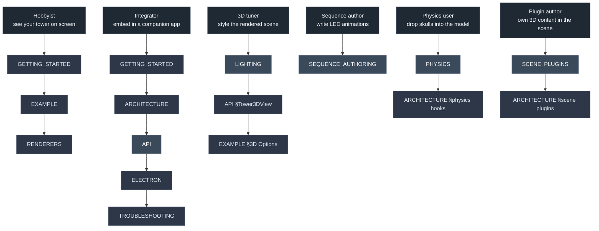

# Documentation index

This directory holds the long-form documentation for `ultimatedarktowerdisplay`. The repo's [main README](../README.md) is the npm landing page; everything past a quick start lives here.

## Pick your path

If you are a **hobbyist** with a Dark Tower and want it on screen with minimal code, read [GETTING_STARTED](GETTING_STARTED.md), then page through [EXAMPLE](EXAMPLE.md) to see what the demo can do. If you are an **integrator** embedding the renderer in a companion app, follow GETTING_STARTED into [ARCHITECTURE](ARCHITECTURE.md) for the mental model, then [API](API.md) for reference. If you are a **3D tuner** styling the rendered scene, jump straight to [LIGHTING](LIGHTING.md). If you are writing **LED sequences**, [SEQUENCE_AUTHORING](SEQUENCE_AUTHORING.md) is self-contained. If you are adding **skull physics**, start in [PHYSICS](PHYSICS.md). If you are building a **plugin** that owns its own 3D content in the scene (a board, tokens, effects), read [SCENE_PLUGINS](SCENE_PLUGINS.md).

## By role

### Hobbyist getting first pixels on screen
1. [GETTING_STARTED](GETTING_STARTED.md) — prerequisites, install, what `TowerState` is, first render.
2. [EXAMPLE](EXAMPLE.md) — guided tour of the demo and every control it exposes.
3. [RENDERERS](RENDERERS.md) — pick the renderer that fits your app.

### Integrator embedding the renderer in a companion app
1. [GETTING_STARTED](GETTING_STARTED.md) — covers framework integration sketches (vanilla, React, Vue).
2. [ARCHITECTURE](ARCHITECTURE.md) — data flow, composition, lifecycle, subsystem map.
3. [API](API.md) — full reference for every public class, method, and option.
4. [ELECTRON](ELECTRON.md) — Electron renderer integration (CSP, BLE picker, modelUrl).
5. [TROUBLESHOOTING](TROUBLESHOOTING.md) — common failure modes with fixes.

### 3D tuner styling the rendered scene
1. [LIGHTING](LIGHTING.md) — three-point rig, bloom, skybox, ground disc, full default config.
2. [API §Tower3DView](API.md#tower3dview) — lighting and camera config methods.
3. [EXAMPLE §3D Options](EXAMPLE.md#panel-3d-options-lighting-and-scene) — what the demo's sliders do.

### Sequence author writing LED animations
1. [SEQUENCE_AUTHORING](SEQUENCE_AUTHORING.md) — JSON schema, every track kind, examples.

### Physics add-on user
1. [PHYSICS](PHYSICS.md) — quick start, parallel-collider model, tuning guide.
2. [ARCHITECTURE §where physics plugs in](ARCHITECTURE.md#where-physics-plugs-in) — the `TowerPhysicsHooks` seam.

### Scene-plugin / content author
1. [SCENE_PLUGINS](SCENE_PLUGINS.md) — the plugin lifecycle, context, disc positioning, pointer targets, UI docking, a minimal example.
2. [ARCHITECTURE §scene plugins](ARCHITECTURE.md#scene-plugins-the-generalized-seam) — where the seam sits in the system.
3. [API §Scene plugins](API.md#scene-plugins) — type-level reference.

## By topic

| Doc | Audience | Type | Lines | What it covers |
|---|---|---|---|---|
| [GETTING_STARTED](GETTING_STARTED.md) | Hobbyist + integrator | Guide | ~280 | Prerequisites, install, `TowerState` shape, lifecycle, framework patterns, UDT wiring. |
| [ARCHITECTURE](ARCHITECTURE.md) | Integrator + contributor | Guide | ~260 | Mental model, data flow, composition, lifecycle, subsystem map, extension points. |
| [RENDERERS](RENDERERS.md) | Hobbyist + integrator | Reference | ~240 | Feature matrix, per-renderer deep dives, idle states, compat, bundle size. |
| [EXAMPLE](EXAMPLE.md) | Hobbyist + integrator | Walkthrough | ~290 | Tour of `example/`, one section per toolbar panel, patterns to lift. |
| [API](API.md) | Integrator | Reference | ~680 | Canonical reference for every public class, method, option, and type. |
| [LIGHTING](LIGHTING.md) | 3D tuner | Reference | ~842 | Three-point rig, bloom, skybox, LEDs, animations, full default config, tuning recipes. |
| [AUDIO](AUDIO.md) | Integrator + audio author | Guide | ~120 | `SoundPack` model, bundled official pack, custom packs, sequence binding, bundler compatibility. |
| [PHYSICS](PHYSICS.md) | Physics user | Guide | ~236 | Skull physics MVP, opt-in subpath, config, tuning, verification checklist. |
| [SCENE_PLUGINS](SCENE_PLUGINS.md) | Plugin author | Guide | ~170 | The scene-plugin seam: lifecycle, context, disc positioning, board hand-off, pointer targets, UI docking. |
| [SEQUENCE_AUTHORING](SEQUENCE_AUTHORING.md) | Sequence author | Reference | ~653 | JSON schema, nine track kinds, examples, snapshot test integration. |
| [ELECTRON](ELECTRON.md) | Electron integrator | Guide | ~182 | BrowserWindow setup, CSP, modelUrl, Web Bluetooth picker. |
| [TROUBLESHOOTING](TROUBLESHOOTING.md) | All readers | FAQ | ~260 | Predictable failure modes: GLB load, Rapier WASM, BLE gestures, CSP, subpath resolution. |

## Glossary

Terms used across the docs.

- **TowerState** — Plain-object snapshot of the tower's state at one moment. Comes from `ultimatedarktower` (UDT) via `createDefaultTowerState()` or a live BLE connection. Has `drum[]`, `layer[]`, `audio`, `beam`, and `led_sequence` fields.
- **Drum** — One of three rotating cylindrical sections of the physical tower (top, middle, bottom). Each carries glyphs and seal openings. `state.drum[i]` holds calibration flag and rotational position.
- **Layer** — One ring of LEDs around the tower. The tower has six layers numbered 0-5: three drum rings (top/middle/bottom), one ledge ring, and two base rings. `state.layer[i].light[j]` holds the per-light effect.
- **Light** — One LED. Each layer has four lights, one per cardinal side (north, east, south, west). Identified by `(layer, light)` index pair.
- **Glyph** — A symbol painted on a drum face. With three drums and four faces each, there are twelve glyph positions; rotation chooses which glyph faces which side.
- **Seal** — One of twelve circular openings on the tower (3 levels × 4 sides). Identified as `{ side, level }`. A seal is either intact or broken; broken seals are hidden in the rendered views.
- **Beam** — The skull-collection counter on the physical tower. `state.beam.count` increasing between successive `applyState` calls signals a **skull-drop** event.
- **Skull-drop** — A transient highlight in the readout when `beam.count` increases. Used to surface dropped skulls visually since the count itself is small.
- **Calibration** — The process by which the tower learns its drum positions on startup. `state.drum[i].calibrated = true` means the renderer can trust `position` for glyph display.
- **Light effect** — A per-light animation pattern: `off`, `on`, `breathe`, `breatheFast`, `breathe50percent`, or `flicker`. Resolved from the `LIGHT_EFFECTS` enum in UDT.
- **Sequence** — A scripted timeline of light effects, loaded from JSON. Played via `setLedOverride` for one-shot animations such as "victory" or "defeat." See [SEQUENCE_AUTHORING](SEQUENCE_AUTHORING.md).
- **Override** — A temporary light state that supersedes whatever the underlying state would render. Sequences are the typical source; manual override is also possible.

## External resources

- [ultimatedarktower](https://github.com/ChessMess/ultimatedarktower) — the BLE/decoding library this renderer pairs with.
- [ultimatedarktowerboard](https://github.com/ChessMess/UltimateDarkTowerBoard) — state + renderers for the game board/mat; its 3D board attaches to this renderer as a `ScenePlugin` (see [SCENE_PLUGINS](SCENE_PLUGINS.md)).
- [Return to Dark Tower](https://restorationgames.com/dark-tower/) — the board game and physical peripheral.
- [Live demo](https://chessmess.github.io/UltimateDarkTowerDisplay/) — interactive playground deployed from `example/`.

## See also

- [Repo README](../README.md) — npm landing page, install, quick start.
- [CHANGELOG](../CHANGELOG.md) — release history.
- [CONTRIBUTING](../CONTRIBUTING.md) — development workflow.
